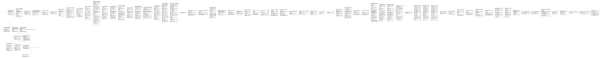

# postgres

## Tables

| Name | Columns | Comment | Type |
| ---- | ------- | ------- | ---- |
| [source.payment_type](source.payment_type.md) | 6 |  | BASE TABLE |
| [source.customer](source.customer.md) | 11 |  | BASE TABLE |
| [source.customer_audit](source.customer_audit.md) | 13 |  | BASE TABLE |
| [source.emails](source.emails.md) | 5 |  | BASE TABLE |
| [source.store](source.store.md) | 9 |  | BASE TABLE |
| [source.order](source.order.md) | 5 |  | BASE TABLE |
| [source.product_category](source.product_category.md) | 4 |  | BASE TABLE |
| [source.product](source.product.md) | 5 |  | BASE TABLE |
| [source.product_price](source.product_price.md) | 8 |  | BASE TABLE |
| [source.order_detail](source.order_detail.md) | 7 |  | BASE TABLE |
| [source.invoice](source.invoice.md) | 7 |  | BASE TABLE |
| [source.financial_account](source.financial_account.md) | 7 |  | BASE TABLE |
| [source.payment](source.payment.md) | 7 |  | BASE TABLE |
| [source.integration](source.integration.md) | 6 |  | BASE TABLE |
| [source.order_json](source.order_json.md) | 4 |  | BASE TABLE |
| [source.sales_data](source.sales_data.md) | 11 |  | BASE TABLE |
| [dbt_stg.data_monitoring_metrics](dbt_stg.data_monitoring_metrics.md) | 15 |  | BASE TABLE |
| [dbt_stg.dbt_columns](dbt_stg.dbt_columns.md) | 13 |  | BASE TABLE |
| [dbt_stg.dbt_exposures](dbt_stg.dbt_exposures.md) | 20 |  | BASE TABLE |
| [dbt_stg.dbt_invocations](dbt_stg.dbt_invocations.md) | 35 |  | BASE TABLE |
| [dbt_stg.dbt_metrics](dbt_stg.dbt_metrics.md) | 20 |  | BASE TABLE |
| [dbt_stg.dbt_models](dbt_stg.dbt_models.md) | 19 |  | BASE TABLE |
| [dbt_stg.dbt_run_results](dbt_stg.dbt_run_results.md) | 22 |  | BASE TABLE |
| [dbt_stg.dbt_seeds](dbt_stg.dbt_seeds.md) | 15 |  | BASE TABLE |
| [dbt_stg.dbt_snapshots](dbt_stg.dbt_snapshots.md) | 19 |  | BASE TABLE |
| [dbt_stg.dbt_source_freshness_results](dbt_stg.dbt_source_freshness_results.md) | 17 |  | BASE TABLE |
| [dbt_stg.dbt_sources](dbt_stg.dbt_sources.md) | 22 |  | BASE TABLE |
| [dbt_stg.dbt_tests](dbt_stg.dbt_tests.md) | 28 |  | BASE TABLE |
| [dbt_stg.elementary_test_results](dbt_stg.elementary_test_results.md) | 28 |  | BASE TABLE |
| [dbt_stg.metadata](dbt_stg.metadata.md) | 1 |  | BASE TABLE |
| [dbt_stg.schema_columns_snapshot](dbt_stg.schema_columns_snapshot.md) | 8 |  | BASE TABLE |
| [marts.customer_integration_history_scd2](marts.customer_integration_history_scd2.md) | 6 |  | BASE TABLE |
| [dim.dim_customers](dim.dim_customers.md) | 16 |  | BASE TABLE |
| [dim.dim_financial_accounts](dim.dim_financial_accounts.md) | 7 |  | BASE TABLE |
| [dim.dim_payment_types](dim.dim_payment_types.md) | 6 |  | BASE TABLE |
| [dim.dim_products](dim.dim_products.md) | 5 |  | BASE TABLE |
| [dim.dim_stores](dim.dim_stores.md) | 9 |  | BASE TABLE |
| [fact.fact_emails](fact.fact_emails.md) | 6 |  | BASE TABLE |
| [fact.fact_orders_external_system](fact.fact_orders_external_system.md) | 8 |  | BASE TABLE |
| [fact.fact_orders_generalized](fact.fact_orders_generalized.md) | 9 |  | BASE TABLE |
| [fact.fact_payments](fact.fact_payments.md) | 9 |  | BASE TABLE |
| [marts.incremental_pk_tester](marts.incremental_pk_tester.md) | 5 |  | BASE TABLE |
| [marts.incremental_pk_tester_merge_only](marts.incremental_pk_tester_merge_only.md) | 5 |  | BASE TABLE |
| [marts.incremental_tester](marts.incremental_tester.md) | 5 |  | BASE TABLE |
| [dbt_stg.ohshit](dbt_stg.ohshit.md) | 4 |  | BASE TABLE |
| [dbt_stg.country_codes](dbt_stg.country_codes.md) | 2 |  | BASE TABLE |
| [dbt_stg.orders_snapshot](dbt_stg.orders_snapshot.md) | 11 |  | BASE TABLE |
| [dbt_stg.metrics_anomaly_score](dbt_stg.metrics_anomaly_score.md) | 17 |  | VIEW |
| [dbt_stg.monitors_runs](dbt_stg.monitors_runs.md) | 6 |  | VIEW |
| [dbt_stg.job_run_results](dbt_stg.job_run_results.md) | 6 |  | VIEW |
| [dbt_stg.model_run_results](dbt_stg.model_run_results.md) | 29 |  | VIEW |
| [dbt_stg.seed_run_results](dbt_stg.seed_run_results.md) | 26 |  | VIEW |
| [dbt_stg.snapshot_run_results](dbt_stg.snapshot_run_results.md) | 26 |  | VIEW |
| [dbt_stg.alerts_dbt_source_freshness](dbt_stg.alerts_dbt_source_freshness.md) | 23 |  | VIEW |
| [dbt_stg.dbt_artifacts_hashes](dbt_stg.dbt_artifacts_hashes.md) | 2 |  | VIEW |
| [dbt_stg.alerts_anomaly_detection](dbt_stg.alerts_anomaly_detection.md) | 23 |  | VIEW |
| [dbt_stg.alerts_dbt_tests](dbt_stg.alerts_dbt_tests.md) | 23 |  | VIEW |
| [dbt_stg.alerts_schema_changes](dbt_stg.alerts_schema_changes.md) | 23 |  | VIEW |
| [dbt_stg.test_result_rows](dbt_stg.test_result_rows.md) | 4 |  | BASE TABLE |
| [dbt_stg.failed_tests](dbt_stg.failed_tests.md) | 5 |  | BASE TABLE |
| [marts.emails_subject_cols](marts.emails_subject_cols.md) | 9 |  | BASE TABLE |
| [marts.emails_subject_concat](marts.emails_subject_concat.md) | 6 |  | BASE TABLE |
| [fact.fact_orders_detailed](fact.fact_orders_detailed.md) | 11 |  | BASE TABLE |
| [fact.fact_product_prices](fact.fact_product_prices.md) | 8 |  | BASE TABLE |
| [dbt_stg.anomaly_threshold_sensitivity](dbt_stg.anomaly_threshold_sensitivity.md) | 14 |  | VIEW |
| [dbt_stg.alerts_dbt_models](dbt_stg.alerts_dbt_models.md) | 14 |  | VIEW |
| [dim.dim_integrations](dim.dim_integrations.md) | 7 |  | BASE TABLE |
| [marts.accounting_by_state_agg](marts.accounting_by_state_agg.md) | 4 |  | BASE TABLE |
| [marts.accounting_by_store_agg](marts.accounting_by_store_agg.md) | 4 |  | BASE TABLE |
| [marts.customer_payments_by_invoice](marts.customer_payments_by_invoice.md) | 11 |  | BASE TABLE |
| [dbt_stg.countries](dbt_stg.countries.md) | 4 |  | BASE TABLE |
| [marts.customers_to_email](marts.customers_to_email.md) | 5 |  | BASE TABLE |
| [marts.most_popular_products_agg](marts.most_popular_products_agg.md) | 3 |  | BASE TABLE |
| [marts.most_popular_products_by_store_agg](marts.most_popular_products_by_store_agg.md) | 4 |  | BASE TABLE |
| [marts.outstanding_invoices](marts.outstanding_invoices.md) | 8 |  | BASE TABLE |

## Enums

| Name | Values |
| ---- | ------- |
| source.financial_account_enum | Asset, Equity, Expense, Liability, Revenue |
| source.integration_enum | Hubspot, Mailchimp, Salesforce |
| source.payment_enum | Cash, Credit Card, Debit Card, Gift Card |

## Relations

---

> Generated by [tbls](https://github.com/k1LoW/tbls)
