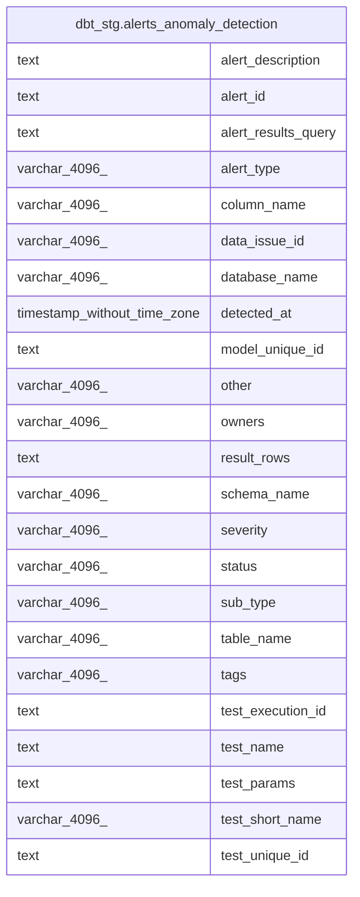

# dbt_stg.alerts_anomaly_detection

## Description

<details>
<summary><strong>Table Definition</strong></summary>

```sql
CREATE VIEW alerts_anomaly_detection AS (
 WITH elementary_test_results AS (
         SELECT elementary_test_results.id,
            elementary_test_results.data_issue_id,
            elementary_test_results.test_execution_id,
            elementary_test_results.test_unique_id,
            elementary_test_results.model_unique_id,
            elementary_test_results.invocation_id,
            elementary_test_results.detected_at,
            elementary_test_results.created_at,
            elementary_test_results.database_name,
            elementary_test_results.schema_name,
            elementary_test_results.table_name,
            elementary_test_results.column_name,
            elementary_test_results.test_type,
            elementary_test_results.test_sub_type,
            elementary_test_results.test_results_description,
            elementary_test_results.owners,
            elementary_test_results.tags,
            elementary_test_results.test_results_query,
            elementary_test_results.other,
            elementary_test_results.test_name,
            elementary_test_results.test_params,
            elementary_test_results.severity,
            elementary_test_results.status,
            elementary_test_results.failures,
            elementary_test_results.test_short_name,
            elementary_test_results.test_alias,
            elementary_test_results.result_rows,
            elementary_test_results.failed_row_count
           FROM dbt_stg.elementary_test_results
        ), alerts_anomaly_detection AS (
         SELECT elementary_test_results.id AS alert_id,
            elementary_test_results.data_issue_id,
            elementary_test_results.test_execution_id,
            elementary_test_results.test_unique_id,
            elementary_test_results.model_unique_id,
            elementary_test_results.detected_at,
            elementary_test_results.database_name,
            elementary_test_results.schema_name,
            elementary_test_results.table_name,
            elementary_test_results.column_name,
            elementary_test_results.test_type AS alert_type,
            elementary_test_results.test_sub_type AS sub_type,
            elementary_test_results.test_results_description AS alert_description,
            elementary_test_results.owners,
            elementary_test_results.tags,
            elementary_test_results.test_results_query AS alert_results_query,
            elementary_test_results.other,
            elementary_test_results.test_name,
            elementary_test_results.test_short_name,
            elementary_test_results.test_params,
            elementary_test_results.severity,
            elementary_test_results.status,
            elementary_test_results.result_rows
           FROM elementary_test_results
          WHERE (true AND (lower((elementary_test_results.status)::text) <> 'pass'::text) AND (lower((elementary_test_results.status)::text) <> 'skipped'::text) AND ((elementary_test_results.test_type)::text = 'anomaly_detection'::text))
        )
 SELECT alert_id,
    data_issue_id,
    test_execution_id,
    test_unique_id,
    model_unique_id,
    detected_at,
    database_name,
    schema_name,
    table_name,
    column_name,
    alert_type,
    sub_type,
    alert_description,
    owners,
    tags,
    alert_results_query,
    other,
    test_name,
    test_short_name,
    test_params,
    severity,
    status,
    result_rows
   FROM alerts_anomaly_detection
)
```

</details>

## Columns

| #  | Name                | Type                        | Default | Nullable | Children | Parents | Comment |
| -- | ------------------- | --------------------------- | ------- | -------- | -------- | ------- | ------- |
| 1  | alert_description   | text                        |         | true     |          |         |         |
| 2  | alert_id            | text                        |         | true     |          |         |         |
| 3  | alert_results_query | text                        |         | true     |          |         |         |
| 4  | alert_type          | varchar(4096)               |         | true     |          |         |         |
| 5  | column_name         | varchar(4096)               |         | true     |          |         |         |
| 6  | data_issue_id       | varchar(4096)               |         | true     |          |         |         |
| 7  | database_name       | varchar(4096)               |         | true     |          |         |         |
| 8  | detected_at         | timestamp without time zone |         | true     |          |         |         |
| 9  | model_unique_id     | text                        |         | true     |          |         |         |
| 10 | other               | varchar(4096)               |         | true     |          |         |         |
| 11 | owners              | varchar(4096)               |         | true     |          |         |         |
| 12 | result_rows         | text                        |         | true     |          |         |         |
| 13 | schema_name         | varchar(4096)               |         | true     |          |         |         |
| 14 | severity            | varchar(4096)               |         | true     |          |         |         |
| 15 | status              | varchar(4096)               |         | true     |          |         |         |
| 16 | sub_type            | varchar(4096)               |         | true     |          |         |         |
| 17 | table_name          | varchar(4096)               |         | true     |          |         |         |
| 18 | tags                | varchar(4096)               |         | true     |          |         |         |
| 19 | test_execution_id   | text                        |         | true     |          |         |         |
| 20 | test_name           | text                        |         | true     |          |         |         |
| 21 | test_params         | text                        |         | true     |          |         |         |
| 22 | test_short_name     | varchar(4096)               |         | true     |          |         |         |
| 23 | test_unique_id      | text                        |         | true     |          |         |         |

## Referenced Tables

| # | # | Name                                                                  | Columns | Comment | Type       |
| - | - | --------------------------------------------------------------------- | ------- | ------- | ---------- |
| 1 | 1 | [dbt_stg.elementary_test_results](dbt_stg.elementary_test_results.md) | 28      |         | BASE TABLE |
| 2 | 2 | [alerts_anomaly_detection](alerts_anomaly_detection.md)               | 0       |         |            |

## Relations



---

> Generated by [tbls](https://github.com/k1LoW/tbls)
