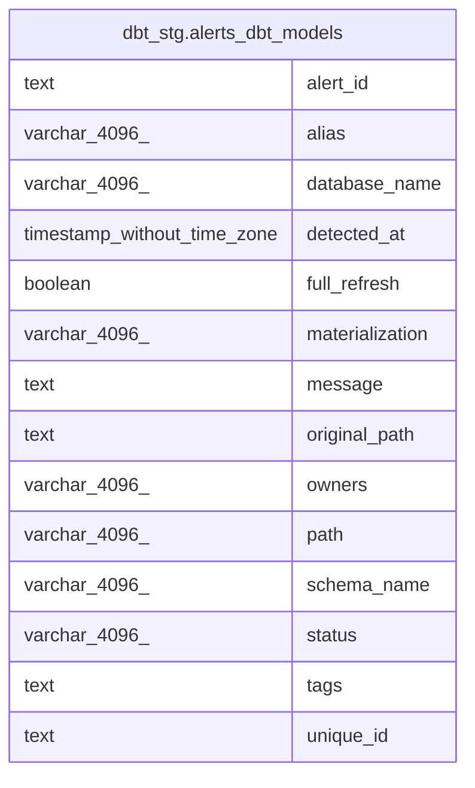

# dbt_stg.alerts_dbt_models

## Description

<details>
<summary><strong>Table Definition</strong></summary>

```sql
CREATE VIEW alerts_dbt_models AS (
 WITH error_models AS (
         SELECT model_run_results.model_execution_id,
            model_run_results.unique_id,
            model_run_results.invocation_id,
            model_run_results.name,
            model_run_results.generated_at,
            model_run_results.status,
            model_run_results.full_refresh,
            model_run_results.message,
            model_run_results.execution_time,
            model_run_results.execute_started_at,
            model_run_results.execute_completed_at,
            model_run_results.compile_started_at,
            model_run_results.compile_completed_at,
            model_run_results.compiled_code,
            model_run_results.database_name,
            model_run_results.schema_name,
            model_run_results.materialization,
            model_run_results.tags,
            model_run_results.package_name,
            model_run_results.path,
            model_run_results.original_path,
            model_run_results.owner,
            model_run_results.alias
           FROM dbt_stg.model_run_results
        UNION ALL
         SELECT snapshot_run_results.model_execution_id,
            snapshot_run_results.unique_id,
            snapshot_run_results.invocation_id,
            snapshot_run_results.name,
            snapshot_run_results.generated_at,
            snapshot_run_results.status,
            snapshot_run_results.full_refresh,
            snapshot_run_results.message,
            snapshot_run_results.execution_time,
            snapshot_run_results.execute_started_at,
            snapshot_run_results.execute_completed_at,
            snapshot_run_results.compile_started_at,
            snapshot_run_results.compile_completed_at,
            snapshot_run_results.compiled_code,
            snapshot_run_results.database_name,
            snapshot_run_results.schema_name,
            snapshot_run_results.materialization,
            snapshot_run_results.tags,
            snapshot_run_results.package_name,
            snapshot_run_results.path,
            snapshot_run_results.original_path,
            snapshot_run_results.owner,
            snapshot_run_results.alias
           FROM dbt_stg.snapshot_run_results
        )
 SELECT model_execution_id AS alert_id,
    unique_id,
    (generated_at)::timestamp without time zone AS detected_at,
    database_name,
    materialization,
    path,
    original_path,
    schema_name,
    message,
    owner AS owners,
    tags,
    alias,
    status,
    full_refresh
   FROM error_models
  WHERE (true AND (lower((status)::text) <> 'success'::text) AND (lower((status)::text) <> 'skipped'::text))
)
```

</details>

## Columns

| #  | Name            | Type                        | Default | Nullable | Children | Parents | Comment |
| -- | --------------- | --------------------------- | ------- | -------- | -------- | ------- | ------- |
| 1  | alert_id        | text                        |         | true     |          |         |         |
| 2  | alias           | varchar(4096)               |         | true     |          |         |         |
| 3  | database_name   | varchar(4096)               |         | true     |          |         |         |
| 4  | detected_at     | timestamp without time zone |         | true     |          |         |         |
| 5  | full_refresh    | boolean                     |         | true     |          |         |         |
| 6  | materialization | varchar(4096)               |         | true     |          |         |         |
| 7  | message         | text                        |         | true     |          |         |         |
| 8  | original_path   | text                        |         | true     |          |         |         |
| 9  | owners          | varchar(4096)               |         | true     |          |         |         |
| 10 | path            | varchar(4096)               |         | true     |          |         |         |
| 11 | schema_name     | varchar(4096)               |         | true     |          |         |         |
| 12 | status          | varchar(4096)               |         | true     |          |         |         |
| 13 | tags            | text                        |         | true     |          |         |         |
| 14 | unique_id       | text                        |         | true     |          |         |         |

## Referenced Tables

| # | # | Name                                                            | Columns | Comment | Type |
| - | - | --------------------------------------------------------------- | ------- | ------- | ---- |
| 1 | 1 | [dbt_stg.model_run_results](dbt_stg.model_run_results.md)       | 29      |         | VIEW |
| 2 | 2 | [dbt_stg.snapshot_run_results](dbt_stg.snapshot_run_results.md) | 26      |         | VIEW |

## Relations



---

> Generated by [tbls](https://github.com/k1LoW/tbls)
