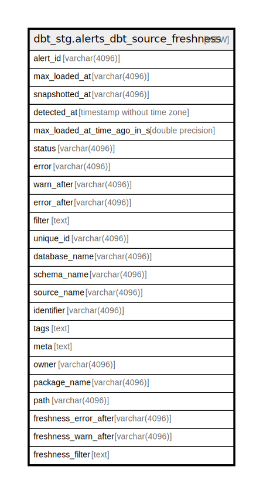

# dbt_stg.alerts_dbt_source_freshness

## Description

<details>
<summary><strong>Table Definition</strong></summary>

```sql
CREATE VIEW alerts_dbt_source_freshness AS (
 WITH results AS (
         SELECT dbt_source_freshness_results.source_freshness_execution_id,
            dbt_source_freshness_results.unique_id,
            dbt_source_freshness_results.max_loaded_at,
            dbt_source_freshness_results.snapshotted_at,
            dbt_source_freshness_results.generated_at,
            dbt_source_freshness_results.created_at,
            dbt_source_freshness_results.max_loaded_at_time_ago_in_s,
            dbt_source_freshness_results.status,
            dbt_source_freshness_results.error,
            dbt_source_freshness_results.compile_started_at,
            dbt_source_freshness_results.compile_completed_at,
            dbt_source_freshness_results.execute_started_at,
            dbt_source_freshness_results.execute_completed_at,
            dbt_source_freshness_results.invocation_id,
            dbt_source_freshness_results.warn_after,
            dbt_source_freshness_results.error_after,
            dbt_source_freshness_results.filter
           FROM dbt_stg.dbt_source_freshness_results
        ), sources AS (
         SELECT dbt_sources.unique_id,
            dbt_sources.database_name,
            dbt_sources.schema_name,
            dbt_sources.source_name,
            dbt_sources.name,
            dbt_sources.identifier,
            dbt_sources.loaded_at_field,
            dbt_sources.freshness_warn_after,
            dbt_sources.freshness_error_after,
            dbt_sources.freshness_filter,
            dbt_sources.freshness_description,
            dbt_sources.relation_name,
            dbt_sources.tags,
            dbt_sources.meta,
            dbt_sources.owner,
            dbt_sources.package_name,
            dbt_sources.original_path,
            dbt_sources.path,
            dbt_sources.source_description,
            dbt_sources.description,
            dbt_sources.generated_at,
            dbt_sources.metadata_hash
           FROM dbt_stg.dbt_sources
        )
 SELECT results.source_freshness_execution_id AS alert_id,
    results.max_loaded_at,
    results.snapshotted_at,
    (results.generated_at)::timestamp without time zone AS detected_at,
    results.max_loaded_at_time_ago_in_s,
    results.status,
    results.error,
    results.warn_after,
    results.error_after,
    results.filter,
    sources.unique_id,
    sources.database_name,
    sources.schema_name,
    sources.source_name,
    sources.identifier,
    sources.tags,
    sources.meta,
    sources.owner,
    sources.package_name,
    sources.path,
    results.error_after AS freshness_error_after,
    results.warn_after AS freshness_warn_after,
    results.filter AS freshness_filter
   FROM (results
     JOIN sources ON (((results.unique_id)::text = (sources.unique_id)::text)))
  WHERE (true AND (lower((results.status)::text) <> 'pass'::text))
)
```

</details>

## Columns

| Name | Type | Default | Nullable | Children | Parents | Comment |
| ---- | ---- | ------- | -------- | -------- | ------- | ------- |
| alert_id | varchar(4096) |  | true |  |  |  |
| max_loaded_at | varchar(4096) |  | true |  |  |  |
| snapshotted_at | varchar(4096) |  | true |  |  |  |
| detected_at | timestamp without time zone |  | true |  |  |  |
| max_loaded_at_time_ago_in_s | double precision |  | true |  |  |  |
| status | varchar(4096) |  | true |  |  |  |
| error | varchar(4096) |  | true |  |  |  |
| warn_after | varchar(4096) |  | true |  |  |  |
| error_after | varchar(4096) |  | true |  |  |  |
| filter | text |  | true |  |  |  |
| unique_id | varchar(4096) |  | true |  |  |  |
| database_name | varchar(4096) |  | true |  |  |  |
| schema_name | varchar(4096) |  | true |  |  |  |
| source_name | varchar(4096) |  | true |  |  |  |
| identifier | varchar(4096) |  | true |  |  |  |
| tags | text |  | true |  |  |  |
| meta | text |  | true |  |  |  |
| owner | varchar(4096) |  | true |  |  |  |
| package_name | varchar(4096) |  | true |  |  |  |
| path | varchar(4096) |  | true |  |  |  |
| freshness_error_after | varchar(4096) |  | true |  |  |  |
| freshness_warn_after | varchar(4096) |  | true |  |  |  |
| freshness_filter | text |  | true |  |  |  |

## Referenced Tables

| Name | Columns | Comment | Type |
| ---- | ------- | ------- | ---- |
| [dbt_stg.dbt_source_freshness_results](dbt_stg.dbt_source_freshness_results.md) | 17 |  | BASE TABLE |
| [dbt_stg.dbt_sources](dbt_stg.dbt_sources.md) | 22 |  | BASE TABLE |
| [sources](sources.md) | 0 |  |  |

## Relations



---

> Generated by [tbls](https://github.com/k1LoW/tbls)
