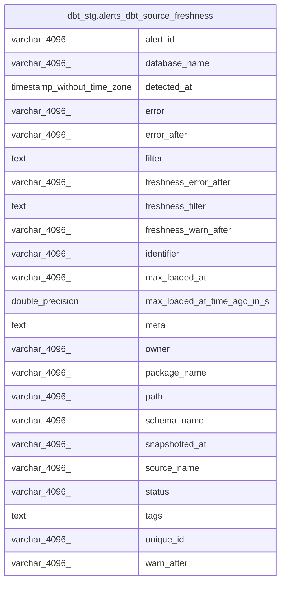

# dbt_stg.alerts_dbt_source_freshness

## Description

<details>
<summary><strong>Table Definition</strong></summary>

```sql
CREATE VIEW alerts_dbt_source_freshness AS (
 WITH results AS (
         SELECT dbt_source_freshness_results.source_freshness_execution_id,
            dbt_source_freshness_results.unique_id,
            dbt_source_freshness_results.max_loaded_at,
            dbt_source_freshness_results.snapshotted_at,
            dbt_source_freshness_results.generated_at,
            dbt_source_freshness_results.created_at,
            dbt_source_freshness_results.max_loaded_at_time_ago_in_s,
            dbt_source_freshness_results.status,
            dbt_source_freshness_results.error,
            dbt_source_freshness_results.compile_started_at,
            dbt_source_freshness_results.compile_completed_at,
            dbt_source_freshness_results.execute_started_at,
            dbt_source_freshness_results.execute_completed_at,
            dbt_source_freshness_results.invocation_id,
            dbt_source_freshness_results.warn_after,
            dbt_source_freshness_results.error_after,
            dbt_source_freshness_results.filter
           FROM dbt_stg.dbt_source_freshness_results
        ), sources AS (
         SELECT dbt_sources.unique_id,
            dbt_sources.database_name,
            dbt_sources.schema_name,
            dbt_sources.source_name,
            dbt_sources.name,
            dbt_sources.identifier,
            dbt_sources.loaded_at_field,
            dbt_sources.freshness_warn_after,
            dbt_sources.freshness_error_after,
            dbt_sources.freshness_filter,
            dbt_sources.freshness_description,
            dbt_sources.relation_name,
            dbt_sources.tags,
            dbt_sources.meta,
            dbt_sources.owner,
            dbt_sources.package_name,
            dbt_sources.original_path,
            dbt_sources.path,
            dbt_sources.source_description,
            dbt_sources.description,
            dbt_sources.generated_at,
            dbt_sources.metadata_hash
           FROM dbt_stg.dbt_sources
        )
 SELECT results.source_freshness_execution_id AS alert_id,
    results.max_loaded_at,
    results.snapshotted_at,
    (results.generated_at)::timestamp without time zone AS detected_at,
    results.max_loaded_at_time_ago_in_s,
    results.status,
    results.error,
    results.warn_after,
    results.error_after,
    results.filter,
    sources.unique_id,
    sources.database_name,
    sources.schema_name,
    sources.source_name,
    sources.identifier,
    sources.tags,
    sources.meta,
    sources.owner,
    sources.package_name,
    sources.path,
    results.error_after AS freshness_error_after,
    results.warn_after AS freshness_warn_after,
    results.filter AS freshness_filter
   FROM (results
     JOIN sources ON (((results.unique_id)::text = (sources.unique_id)::text)))
  WHERE (true AND (lower((results.status)::text) <> 'pass'::text))
)
```

</details>

## Columns

| #  | Name                        | Type                        | Default | Nullable | Children | Parents | Comment |
| -- | --------------------------- | --------------------------- | ------- | -------- | -------- | ------- | ------- |
| 1  | alert_id                    | varchar(4096)               |         | true     |          |         |         |
| 2  | database_name               | varchar(4096)               |         | true     |          |         |         |
| 3  | detected_at                 | timestamp without time zone |         | true     |          |         |         |
| 4  | error                       | varchar(4096)               |         | true     |          |         |         |
| 5  | error_after                 | varchar(4096)               |         | true     |          |         |         |
| 6  | filter                      | text                        |         | true     |          |         |         |
| 7  | freshness_error_after       | varchar(4096)               |         | true     |          |         |         |
| 8  | freshness_filter            | text                        |         | true     |          |         |         |
| 9  | freshness_warn_after        | varchar(4096)               |         | true     |          |         |         |
| 10 | identifier                  | varchar(4096)               |         | true     |          |         |         |
| 11 | max_loaded_at               | varchar(4096)               |         | true     |          |         |         |
| 12 | max_loaded_at_time_ago_in_s | double precision            |         | true     |          |         |         |
| 13 | meta                        | text                        |         | true     |          |         |         |
| 14 | owner                       | varchar(4096)               |         | true     |          |         |         |
| 15 | package_name                | varchar(4096)               |         | true     |          |         |         |
| 16 | path                        | varchar(4096)               |         | true     |          |         |         |
| 17 | schema_name                 | varchar(4096)               |         | true     |          |         |         |
| 18 | snapshotted_at              | varchar(4096)               |         | true     |          |         |         |
| 19 | source_name                 | varchar(4096)               |         | true     |          |         |         |
| 20 | status                      | varchar(4096)               |         | true     |          |         |         |
| 21 | tags                        | text                        |         | true     |          |         |         |
| 22 | unique_id                   | varchar(4096)               |         | true     |          |         |         |
| 23 | warn_after                  | varchar(4096)               |         | true     |          |         |         |

## Referenced Tables

| # | # | Name                                                                            | Columns | Comment | Type       |
| - | - | ------------------------------------------------------------------------------- | ------- | ------- | ---------- |
| 1 | 1 | [dbt_stg.dbt_source_freshness_results](dbt_stg.dbt_source_freshness_results.md) | 17      |         | BASE TABLE |
| 2 | 2 | [dbt_stg.dbt_sources](dbt_stg.dbt_sources.md)                                   | 22      |         | BASE TABLE |
| 3 | 3 | [sources](sources.md)                                                           | 0       |         |            |

## Relations



---

> Generated by [tbls](https://github.com/k1LoW/tbls)
