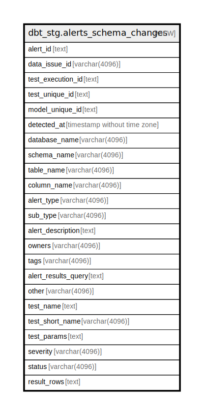

# dbt_stg.alerts_schema_changes

## Description

<details>
<summary><strong>Table Definition</strong></summary>

```sql
CREATE VIEW alerts_schema_changes AS (
 WITH elementary_test_results AS (
         SELECT elementary_test_results.id,
            elementary_test_results.data_issue_id,
            elementary_test_results.test_execution_id,
            elementary_test_results.test_unique_id,
            elementary_test_results.model_unique_id,
            elementary_test_results.invocation_id,
            elementary_test_results.detected_at,
            elementary_test_results.created_at,
            elementary_test_results.database_name,
            elementary_test_results.schema_name,
            elementary_test_results.table_name,
            elementary_test_results.column_name,
            elementary_test_results.test_type,
            elementary_test_results.test_sub_type,
            elementary_test_results.test_results_description,
            elementary_test_results.owners,
            elementary_test_results.tags,
            elementary_test_results.test_results_query,
            elementary_test_results.other,
            elementary_test_results.test_name,
            elementary_test_results.test_params,
            elementary_test_results.severity,
            elementary_test_results.status,
            elementary_test_results.failures,
            elementary_test_results.test_short_name,
            elementary_test_results.test_alias,
            elementary_test_results.result_rows,
            elementary_test_results.failed_row_count
           FROM dbt_stg.elementary_test_results
        ), alerts_schema_changes AS (
         SELECT elementary_test_results.id AS alert_id,
            elementary_test_results.data_issue_id,
            elementary_test_results.test_execution_id,
            elementary_test_results.test_unique_id,
            elementary_test_results.model_unique_id,
            elementary_test_results.detected_at,
            elementary_test_results.database_name,
            elementary_test_results.schema_name,
            elementary_test_results.table_name,
            elementary_test_results.column_name,
            elementary_test_results.test_type AS alert_type,
            elementary_test_results.test_sub_type AS sub_type,
            elementary_test_results.test_results_description AS alert_description,
            elementary_test_results.owners,
            elementary_test_results.tags,
            elementary_test_results.test_results_query AS alert_results_query,
            elementary_test_results.other,
            elementary_test_results.test_name,
            elementary_test_results.test_short_name,
            elementary_test_results.test_params,
            elementary_test_results.severity,
            elementary_test_results.status,
            elementary_test_results.result_rows
           FROM elementary_test_results
          WHERE (true AND (lower((elementary_test_results.status)::text) <> 'pass'::text) AND (lower((elementary_test_results.status)::text) <> 'skipped'::text) AND ((elementary_test_results.test_type)::text = 'schema_change'::text))
        )
 SELECT alert_id,
    data_issue_id,
    test_execution_id,
    test_unique_id,
    model_unique_id,
    detected_at,
    database_name,
    schema_name,
    table_name,
    column_name,
    alert_type,
    sub_type,
    alert_description,
    owners,
    tags,
    alert_results_query,
    other,
    test_name,
    test_short_name,
    test_params,
    severity,
    status,
    result_rows
   FROM alerts_schema_changes
)
```

</details>

## Columns

| Name | Type | Default | Nullable | Children | Parents | Comment |
| ---- | ---- | ------- | -------- | -------- | ------- | ------- |
| alert_id | text |  | true |  |  |  |
| data_issue_id | varchar(4096) |  | true |  |  |  |
| test_execution_id | text |  | true |  |  |  |
| test_unique_id | text |  | true |  |  |  |
| model_unique_id | text |  | true |  |  |  |
| detected_at | timestamp without time zone |  | true |  |  |  |
| database_name | varchar(4096) |  | true |  |  |  |
| schema_name | varchar(4096) |  | true |  |  |  |
| table_name | varchar(4096) |  | true |  |  |  |
| column_name | varchar(4096) |  | true |  |  |  |
| alert_type | varchar(4096) |  | true |  |  |  |
| sub_type | varchar(4096) |  | true |  |  |  |
| alert_description | text |  | true |  |  |  |
| owners | varchar(4096) |  | true |  |  |  |
| tags | varchar(4096) |  | true |  |  |  |
| alert_results_query | text |  | true |  |  |  |
| other | varchar(4096) |  | true |  |  |  |
| test_name | text |  | true |  |  |  |
| test_short_name | varchar(4096) |  | true |  |  |  |
| test_params | text |  | true |  |  |  |
| severity | varchar(4096) |  | true |  |  |  |
| status | varchar(4096) |  | true |  |  |  |
| result_rows | text |  | true |  |  |  |

## Referenced Tables

| Name | Columns | Comment | Type |
| ---- | ------- | ------- | ---- |
| [dbt_stg.elementary_test_results](dbt_stg.elementary_test_results.md) | 28 |  | BASE TABLE |
| [alerts_schema_changes](alerts_schema_changes.md) | 0 |  |  |

## Relations



---

> Generated by [tbls](https://github.com/k1LoW/tbls)
