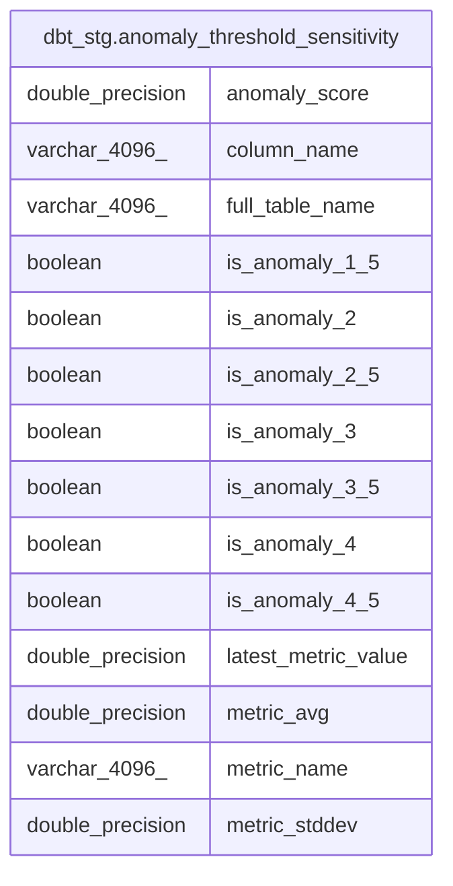

# dbt_stg.anomaly_threshold_sensitivity

## Description

<details>
<summary><strong>Table Definition</strong></summary>

```sql
CREATE VIEW anomaly_threshold_sensitivity AS (
 WITH metrics_anomaly_score AS (
         SELECT metrics_anomaly_score.id,
            metrics_anomaly_score.full_table_name,
            metrics_anomaly_score.column_name,
            metrics_anomaly_score.dimension,
            metrics_anomaly_score.dimension_value,
            metrics_anomaly_score.metric_name,
            metrics_anomaly_score.anomaly_score,
            metrics_anomaly_score.latest_metric_value,
            metrics_anomaly_score.bucket_start,
            metrics_anomaly_score.bucket_end,
            metrics_anomaly_score.training_avg,
            metrics_anomaly_score.training_stddev,
            metrics_anomaly_score.training_start,
            metrics_anomaly_score.training_end,
            metrics_anomaly_score.training_set_size,
            metrics_anomaly_score.updated_at,
            metrics_anomaly_score.is_anomaly
           FROM dbt_stg.metrics_anomaly_score
        ), score_sensitivity AS (
         SELECT metrics_anomaly_score.full_table_name,
            metrics_anomaly_score.column_name,
            metrics_anomaly_score.metric_name,
            metrics_anomaly_score.latest_metric_value,
            metrics_anomaly_score.training_avg AS metric_avg,
            metrics_anomaly_score.training_stddev AS metric_stddev,
            metrics_anomaly_score.anomaly_score,
                CASE
                    WHEN (abs(metrics_anomaly_score.anomaly_score) >= (1.5)::double precision) THEN true
                    ELSE false
                END AS is_anomaly_1_5,
                CASE
                    WHEN (abs(metrics_anomaly_score.anomaly_score) >= (2)::double precision) THEN true
                    ELSE false
                END AS is_anomaly_2,
                CASE
                    WHEN (abs(metrics_anomaly_score.anomaly_score) >= (2.5)::double precision) THEN true
                    ELSE false
                END AS is_anomaly_2_5,
                CASE
                    WHEN (abs(metrics_anomaly_score.anomaly_score) >= (3)::double precision) THEN true
                    ELSE false
                END AS is_anomaly_3,
                CASE
                    WHEN (abs(metrics_anomaly_score.anomaly_score) >= (3.5)::double precision) THEN true
                    ELSE false
                END AS is_anomaly_3_5,
                CASE
                    WHEN (abs(metrics_anomaly_score.anomaly_score) >= (4)::double precision) THEN true
                    ELSE false
                END AS is_anomaly_4,
                CASE
                    WHEN (abs(metrics_anomaly_score.anomaly_score) >= (4.5)::double precision) THEN true
                    ELSE false
                END AS is_anomaly_4_5
           FROM metrics_anomaly_score
          WHERE (abs(metrics_anomaly_score.anomaly_score) >= (1.5)::double precision)
        )
 SELECT full_table_name,
    column_name,
    metric_name,
    latest_metric_value,
    metric_avg,
    metric_stddev,
    anomaly_score,
    is_anomaly_1_5,
    is_anomaly_2,
    is_anomaly_2_5,
    is_anomaly_3,
    is_anomaly_3_5,
    is_anomaly_4,
    is_anomaly_4_5
   FROM score_sensitivity
)
```

</details>

## Columns

| #  | Name                | Type             | Default | Nullable | Children | Parents | Comment |
| -- | ------------------- | ---------------- | ------- | -------- | -------- | ------- | ------- |
| 1  | anomaly_score       | double precision |         | true     |          |         |         |
| 2  | column_name         | varchar(4096)    |         | true     |          |         |         |
| 3  | full_table_name     | varchar(4096)    |         | true     |          |         |         |
| 4  | is_anomaly_1_5      | boolean          |         | true     |          |         |         |
| 5  | is_anomaly_2        | boolean          |         | true     |          |         |         |
| 6  | is_anomaly_2_5      | boolean          |         | true     |          |         |         |
| 7  | is_anomaly_3        | boolean          |         | true     |          |         |         |
| 8  | is_anomaly_3_5      | boolean          |         | true     |          |         |         |
| 9  | is_anomaly_4        | boolean          |         | true     |          |         |         |
| 10 | is_anomaly_4_5      | boolean          |         | true     |          |         |         |
| 11 | latest_metric_value | double precision |         | true     |          |         |         |
| 12 | metric_avg          | double precision |         | true     |          |         |         |
| 13 | metric_name         | varchar(4096)    |         | true     |          |         |         |
| 14 | metric_stddev       | double precision |         | true     |          |         |         |

## Referenced Tables

| # | # | Name                                                              | Columns | Comment | Type |
| - | - | ----------------------------------------------------------------- | ------- | ------- | ---- |
| 1 | 1 | [dbt_stg.metrics_anomaly_score](dbt_stg.metrics_anomaly_score.md) | 17      |         | VIEW |
| 2 | 2 | [score_sensitivity](score_sensitivity.md)                         | 0       |         |      |

## Relations



---

> Generated by [tbls](https://github.com/k1LoW/tbls)
