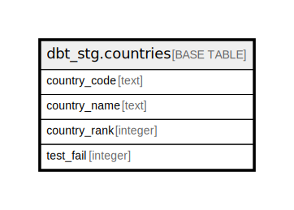

# dbt_stg.countries

## Description

## Columns

| Name | Type | Default | Nullable | Children | Parents | Comment |
| ---- | ---- | ------- | -------- | -------- | ------- | ------- |
| country_code | text |  | true |  |  |  |
| country_name | text |  | true |  |  |  |
| country_rank | integer |  | true |  |  |  |
| test_fail | integer |  | true |  |  |  |

## Relations

---

> Generated by [tbls](https://github.com/k1LoW/tbls)
