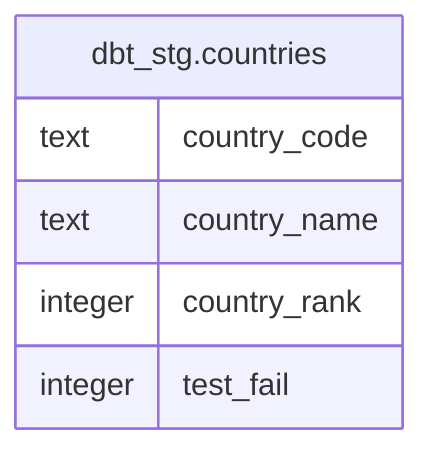

# dbt_stg.countries

## Description

## Columns

| # | Name         | Type    | Default | Nullable | Children | Parents | Comment |
| - | ------------ | ------- | ------- | -------- | -------- | ------- | ------- |
| 1 | country_code | text    |         | true     |          |         |         |
| 2 | country_name | text    |         | true     |          |         |         |
| 3 | country_rank | integer |         | true     |          |         |         |
| 4 | test_fail    | integer |         | true     |          |         |         |

## Relations

---

> Generated by [tbls](https://github.com/k1LoW/tbls)
