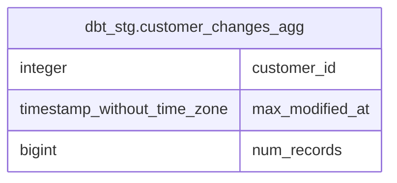

# dbt_stg.customer_changes_agg

## Description

## Columns

| # | Name            | Type                        | Default | Nullable | Children | Parents | Comment |
| - | --------------- | --------------------------- | ------- | -------- | -------- | ------- | ------- |
| 1 | customer_id     | integer                     |         | true     |          |         |         |
| 2 | max_modified_at | timestamp without time zone |         | true     |          |         |         |
| 3 | num_records     | bigint                      |         | true     |          |         |         |

## Relations

---

> Generated by [tbls](https://github.com/k1LoW/tbls)
