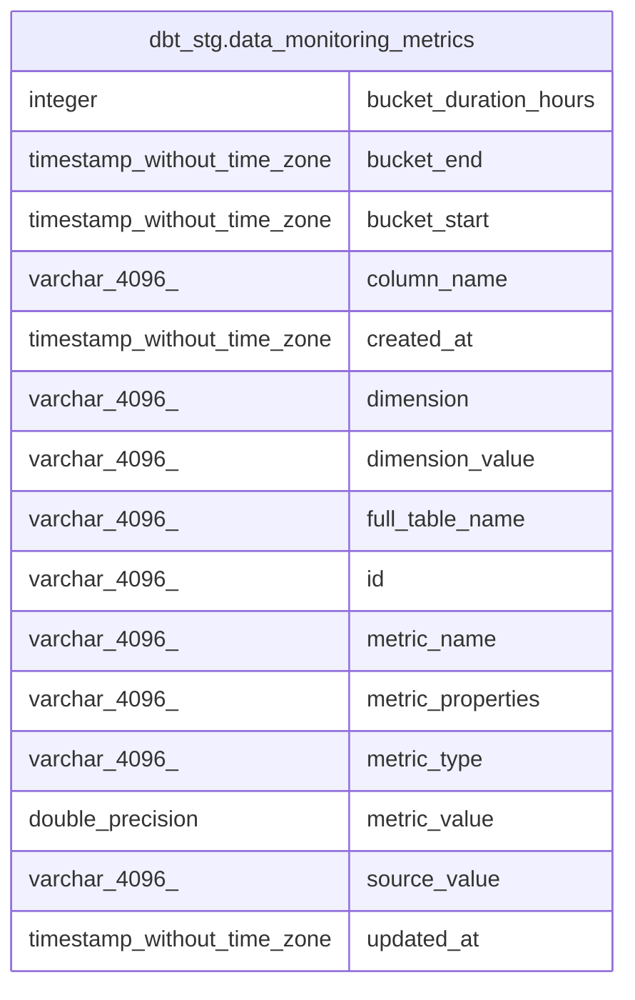

# dbt_stg.data_monitoring_metrics

## Description

## Columns

| #  | Name                  | Type                        | Default | Nullable | Children | Parents | Comment |
| -- | --------------------- | --------------------------- | ------- | -------- | -------- | ------- | ------- |
| 1  | bucket_duration_hours | integer                     |         | true     |          |         |         |
| 2  | bucket_end            | timestamp without time zone |         | true     |          |         |         |
| 3  | bucket_start          | timestamp without time zone |         | true     |          |         |         |
| 4  | column_name           | varchar(4096)               |         | true     |          |         |         |
| 5  | created_at            | timestamp without time zone |         | true     |          |         |         |
| 6  | dimension             | varchar(4096)               |         | true     |          |         |         |
| 7  | dimension_value       | varchar(4096)               |         | true     |          |         |         |
| 8  | full_table_name       | varchar(4096)               |         | true     |          |         |         |
| 9  | id                    | varchar(4096)               |         | true     |          |         |         |
| 10 | metric_name           | varchar(4096)               |         | true     |          |         |         |
| 11 | metric_properties     | varchar(4096)               |         | true     |          |         |         |
| 12 | metric_type           | varchar(4096)               |         | true     |          |         |         |
| 13 | metric_value          | double precision            |         | true     |          |         |         |
| 14 | source_value          | varchar(4096)               |         | true     |          |         |         |
| 15 | updated_at            | timestamp without time zone |         | true     |          |         |         |

## Indexes

| # | Name                             | Definition                                                                                                                                 |
| - | -------------------------------- | ------------------------------------------------------------------------------------------------------------------------------------------ |
| 1 | 2d5906283fd4eb6a9af266299871048f | CREATE INDEX "2d5906283fd4eb6a9af266299871048f" ON dbt_stg.data_monitoring_metrics USING btree (full_table_name, column_name, metric_name) |

## Relations

---

> Generated by [tbls](https://github.com/k1LoW/tbls)
