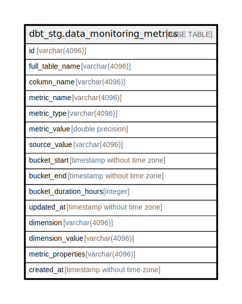

# dbt_stg.data_monitoring_metrics

## Description

## Columns

| Name | Type | Default | Nullable | Children | Parents | Comment |
| ---- | ---- | ------- | -------- | -------- | ------- | ------- |
| id | varchar(4096) |  | true |  |  |  |
| full_table_name | varchar(4096) |  | true |  |  |  |
| column_name | varchar(4096) |  | true |  |  |  |
| metric_name | varchar(4096) |  | true |  |  |  |
| metric_type | varchar(4096) |  | true |  |  |  |
| metric_value | double precision |  | true |  |  |  |
| source_value | varchar(4096) |  | true |  |  |  |
| bucket_start | timestamp without time zone |  | true |  |  |  |
| bucket_end | timestamp without time zone |  | true |  |  |  |
| bucket_duration_hours | integer |  | true |  |  |  |
| updated_at | timestamp without time zone |  | true |  |  |  |
| dimension | varchar(4096) |  | true |  |  |  |
| dimension_value | varchar(4096) |  | true |  |  |  |
| metric_properties | varchar(4096) |  | true |  |  |  |
| created_at | timestamp without time zone |  | true |  |  |  |

## Indexes

| Name | Definition |
| ---- | ---------- |
| 2cd4b1070edc98b5b5d3e75ec5f8ff81 | CREATE INDEX "2cd4b1070edc98b5b5d3e75ec5f8ff81" ON dbt_stg.data_monitoring_metrics USING btree (full_table_name, column_name, metric_name) |

## Relations

---

> Generated by [tbls](https://github.com/k1LoW/tbls)
