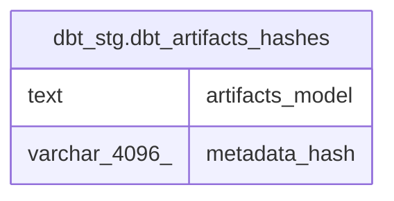

# dbt_stg.dbt_artifacts_hashes

## Description

<details>
<summary><strong>Table Definition</strong></summary>

```sql
CREATE VIEW dbt_artifacts_hashes AS (
 SELECT 'dbt_models'::text AS artifacts_model,
    dbt_models.metadata_hash
   FROM dbt_stg.dbt_models
UNION ALL
 SELECT 'dbt_tests'::text AS artifacts_model,
    dbt_tests.metadata_hash
   FROM dbt_stg.dbt_tests
UNION ALL
 SELECT 'dbt_sources'::text AS artifacts_model,
    dbt_sources.metadata_hash
   FROM dbt_stg.dbt_sources
UNION ALL
 SELECT 'dbt_snapshots'::text AS artifacts_model,
    dbt_snapshots.metadata_hash
   FROM dbt_stg.dbt_snapshots
UNION ALL
 SELECT 'dbt_metrics'::text AS artifacts_model,
    dbt_metrics.metadata_hash
   FROM dbt_stg.dbt_metrics
UNION ALL
 SELECT 'dbt_exposures'::text AS artifacts_model,
    dbt_exposures.metadata_hash
   FROM dbt_stg.dbt_exposures
UNION ALL
 SELECT 'dbt_seeds'::text AS artifacts_model,
    dbt_seeds.metadata_hash
   FROM dbt_stg.dbt_seeds
UNION ALL
 SELECT 'dbt_columns'::text AS artifacts_model,
    dbt_columns.metadata_hash
   FROM dbt_stg.dbt_columns
  ORDER BY 2
)
```

</details>

## Columns

| # | Name            | Type          | Default | Nullable | Children | Parents | Comment |
| - | --------------- | ------------- | ------- | -------- | -------- | ------- | ------- |
| 1 | artifacts_model | text          |         | true     |          |         |         |
| 2 | metadata_hash   | varchar(4096) |         | true     |          |         |         |

## Referenced Tables

| # | # | Name                                              | Columns | Comment | Type       |
| - | - | ------------------------------------------------- | ------- | ------- | ---------- |
| 1 | 1 | [dbt_stg.dbt_models](dbt_stg.dbt_models.md)       | 19      |         | BASE TABLE |
| 2 | 2 | [dbt_stg.dbt_tests](dbt_stg.dbt_tests.md)         | 28      |         | BASE TABLE |
| 3 | 3 | [dbt_stg.dbt_sources](dbt_stg.dbt_sources.md)     | 22      |         | BASE TABLE |
| 4 | 4 | [dbt_stg.dbt_snapshots](dbt_stg.dbt_snapshots.md) | 19      |         | BASE TABLE |
| 5 | 5 | [dbt_stg.dbt_metrics](dbt_stg.dbt_metrics.md)     | 20      |         | BASE TABLE |
| 6 | 6 | [dbt_stg.dbt_exposures](dbt_stg.dbt_exposures.md) | 20      |         | BASE TABLE |
| 7 | 7 | [dbt_stg.dbt_seeds](dbt_stg.dbt_seeds.md)         | 15      |         | BASE TABLE |
| 8 | 8 | [dbt_stg.dbt_columns](dbt_stg.dbt_columns.md)     | 13      |         | BASE TABLE |

## Relations



---

> Generated by [tbls](https://github.com/k1LoW/tbls)
