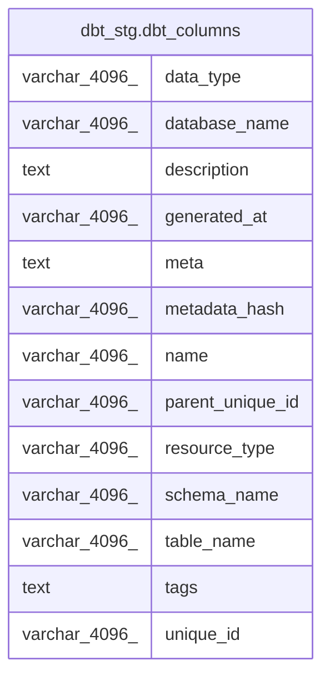

# dbt_stg.dbt_columns

## Description

## Columns

| #  | Name             | Type          | Default | Nullable | Children | Parents | Comment |
| -- | ---------------- | ------------- | ------- | -------- | -------- | ------- | ------- |
| 1  | data_type        | varchar(4096) |         | true     |          |         |         |
| 2  | database_name    | varchar(4096) |         | true     |          |         |         |
| 3  | description      | text          |         | true     |          |         |         |
| 4  | generated_at     | varchar(4096) |         | true     |          |         |         |
| 5  | meta             | text          |         | true     |          |         |         |
| 6  | metadata_hash    | varchar(4096) |         | true     |          |         |         |
| 7  | name             | varchar(4096) |         | true     |          |         |         |
| 8  | parent_unique_id | varchar(4096) |         | true     |          |         |         |
| 9  | resource_type    | varchar(4096) |         | true     |          |         |         |
| 10 | schema_name      | varchar(4096) |         | true     |          |         |         |
| 11 | table_name       | varchar(4096) |         | true     |          |         |         |
| 12 | tags             | text          |         | true     |          |         |         |
| 13 | unique_id        | varchar(4096) |         | true     |          |         |         |

## Relations

---

> Generated by [tbls](https://github.com/k1LoW/tbls)
