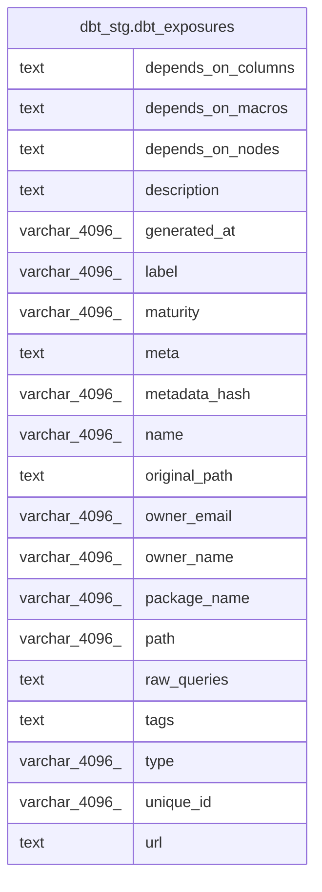

# dbt_stg.dbt_exposures

## Description

## Columns

| #  | Name               | Type          | Default | Nullable | Children | Parents | Comment |
| -- | ------------------ | ------------- | ------- | -------- | -------- | ------- | ------- |
| 1  | depends_on_columns | text          |         | true     |          |         |         |
| 2  | depends_on_macros  | text          |         | true     |          |         |         |
| 3  | depends_on_nodes   | text          |         | true     |          |         |         |
| 4  | description        | text          |         | true     |          |         |         |
| 5  | generated_at       | varchar(4096) |         | true     |          |         |         |
| 6  | label              | varchar(4096) |         | true     |          |         |         |
| 7  | maturity           | varchar(4096) |         | true     |          |         |         |
| 8  | meta               | text          |         | true     |          |         |         |
| 9  | metadata_hash      | varchar(4096) |         | true     |          |         |         |
| 10 | name               | varchar(4096) |         | true     |          |         |         |
| 11 | original_path      | text          |         | true     |          |         |         |
| 12 | owner_email        | varchar(4096) |         | true     |          |         |         |
| 13 | owner_name         | varchar(4096) |         | true     |          |         |         |
| 14 | package_name       | varchar(4096) |         | true     |          |         |         |
| 15 | path               | varchar(4096) |         | true     |          |         |         |
| 16 | raw_queries        | text          |         | true     |          |         |         |
| 17 | tags               | text          |         | true     |          |         |         |
| 18 | type               | varchar(4096) |         | true     |          |         |         |
| 19 | unique_id          | varchar(4096) |         | true     |          |         |         |
| 20 | url                | text          |         | true     |          |         |         |

## Relations

---

> Generated by [tbls](https://github.com/k1LoW/tbls)
