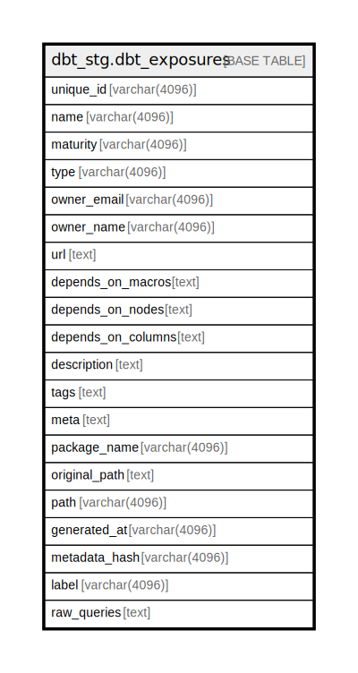

# dbt_stg.dbt_exposures

## Description

## Columns

| Name | Type | Default | Nullable | Children | Parents | Comment |
| ---- | ---- | ------- | -------- | -------- | ------- | ------- |
| unique_id | varchar(4096) |  | true |  |  |  |
| name | varchar(4096) |  | true |  |  |  |
| maturity | varchar(4096) |  | true |  |  |  |
| type | varchar(4096) |  | true |  |  |  |
| owner_email | varchar(4096) |  | true |  |  |  |
| owner_name | varchar(4096) |  | true |  |  |  |
| url | text |  | true |  |  |  |
| depends_on_macros | text |  | true |  |  |  |
| depends_on_nodes | text |  | true |  |  |  |
| depends_on_columns | text |  | true |  |  |  |
| description | text |  | true |  |  |  |
| tags | text |  | true |  |  |  |
| meta | text |  | true |  |  |  |
| package_name | varchar(4096) |  | true |  |  |  |
| original_path | text |  | true |  |  |  |
| path | varchar(4096) |  | true |  |  |  |
| generated_at | varchar(4096) |  | true |  |  |  |
| metadata_hash | varchar(4096) |  | true |  |  |  |
| label | varchar(4096) |  | true |  |  |  |
| raw_queries | text |  | true |  |  |  |

## Relations

---

> Generated by [tbls](https://github.com/k1LoW/tbls)
