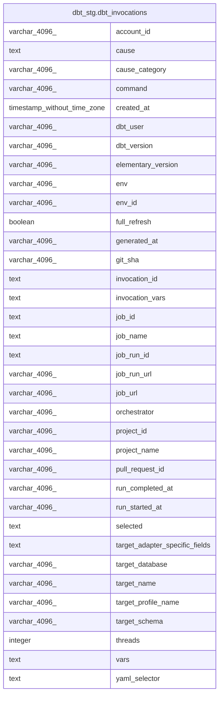

# dbt_stg.dbt_invocations

## Description

## Columns

| #  | Name                           | Type                        | Default | Nullable | Children | Parents | Comment |
| -- | ------------------------------ | --------------------------- | ------- | -------- | -------- | ------- | ------- |
| 1  | account_id                     | varchar(4096)               |         | true     |          |         |         |
| 2  | cause                          | text                        |         | true     |          |         |         |
| 3  | cause_category                 | varchar(4096)               |         | true     |          |         |         |
| 4  | command                        | varchar(4096)               |         | true     |          |         |         |
| 5  | created_at                     | timestamp without time zone |         | true     |          |         |         |
| 6  | dbt_user                       | varchar(4096)               |         | true     |          |         |         |
| 7  | dbt_version                    | varchar(4096)               |         | true     |          |         |         |
| 8  | elementary_version             | varchar(4096)               |         | true     |          |         |         |
| 9  | env                            | varchar(4096)               |         | true     |          |         |         |
| 10 | env_id                         | varchar(4096)               |         | true     |          |         |         |
| 11 | full_refresh                   | boolean                     |         | true     |          |         |         |
| 12 | generated_at                   | varchar(4096)               |         | true     |          |         |         |
| 13 | git_sha                        | varchar(4096)               |         | true     |          |         |         |
| 14 | invocation_id                  | text                        |         | true     |          |         |         |
| 15 | invocation_vars                | text                        |         | true     |          |         |         |
| 16 | job_id                         | text                        |         | true     |          |         |         |
| 17 | job_name                       | text                        |         | true     |          |         |         |
| 18 | job_run_id                     | text                        |         | true     |          |         |         |
| 19 | job_run_url                    | varchar(4096)               |         | true     |          |         |         |
| 20 | job_url                        | varchar(4096)               |         | true     |          |         |         |
| 21 | orchestrator                   | varchar(4096)               |         | true     |          |         |         |
| 22 | project_id                     | varchar(4096)               |         | true     |          |         |         |
| 23 | project_name                   | varchar(4096)               |         | true     |          |         |         |
| 24 | pull_request_id                | varchar(4096)               |         | true     |          |         |         |
| 25 | run_completed_at               | varchar(4096)               |         | true     |          |         |         |
| 26 | run_started_at                 | varchar(4096)               |         | true     |          |         |         |
| 27 | selected                       | text                        |         | true     |          |         |         |
| 28 | target_adapter_specific_fields | text                        |         | true     |          |         |         |
| 29 | target_database                | varchar(4096)               |         | true     |          |         |         |
| 30 | target_name                    | varchar(4096)               |         | true     |          |         |         |
| 31 | target_profile_name            | varchar(4096)               |         | true     |          |         |         |
| 32 | target_schema                  | varchar(4096)               |         | true     |          |         |         |
| 33 | threads                        | integer                     |         | true     |          |         |         |
| 34 | vars                           | text                        |         | true     |          |         |         |
| 35 | yaml_selector                  | text                        |         | true     |          |         |         |

## Relations

---

> Generated by [tbls](https://github.com/k1LoW/tbls)
