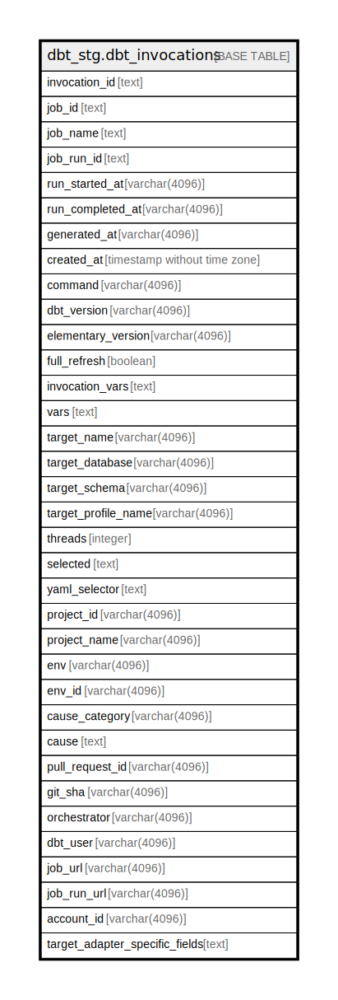

# dbt_stg.dbt_invocations

## Description

## Columns

| Name | Type | Default | Nullable | Children | Parents | Comment |
| ---- | ---- | ------- | -------- | -------- | ------- | ------- |
| invocation_id | text |  | true |  |  |  |
| job_id | text |  | true |  |  |  |
| job_name | text |  | true |  |  |  |
| job_run_id | text |  | true |  |  |  |
| run_started_at | varchar(4096) |  | true |  |  |  |
| run_completed_at | varchar(4096) |  | true |  |  |  |
| generated_at | varchar(4096) |  | true |  |  |  |
| created_at | timestamp without time zone |  | true |  |  |  |
| command | varchar(4096) |  | true |  |  |  |
| dbt_version | varchar(4096) |  | true |  |  |  |
| elementary_version | varchar(4096) |  | true |  |  |  |
| full_refresh | boolean |  | true |  |  |  |
| invocation_vars | text |  | true |  |  |  |
| vars | text |  | true |  |  |  |
| target_name | varchar(4096) |  | true |  |  |  |
| target_database | varchar(4096) |  | true |  |  |  |
| target_schema | varchar(4096) |  | true |  |  |  |
| target_profile_name | varchar(4096) |  | true |  |  |  |
| threads | integer |  | true |  |  |  |
| selected | text |  | true |  |  |  |
| yaml_selector | text |  | true |  |  |  |
| project_id | varchar(4096) |  | true |  |  |  |
| project_name | varchar(4096) |  | true |  |  |  |
| env | varchar(4096) |  | true |  |  |  |
| env_id | varchar(4096) |  | true |  |  |  |
| cause_category | varchar(4096) |  | true |  |  |  |
| cause | text |  | true |  |  |  |
| pull_request_id | varchar(4096) |  | true |  |  |  |
| git_sha | varchar(4096) |  | true |  |  |  |
| orchestrator | varchar(4096) |  | true |  |  |  |
| dbt_user | varchar(4096) |  | true |  |  |  |
| job_url | varchar(4096) |  | true |  |  |  |
| job_run_url | varchar(4096) |  | true |  |  |  |
| account_id | varchar(4096) |  | true |  |  |  |
| target_adapter_specific_fields | text |  | true |  |  |  |

## Relations

---

> Generated by [tbls](https://github.com/k1LoW/tbls)
