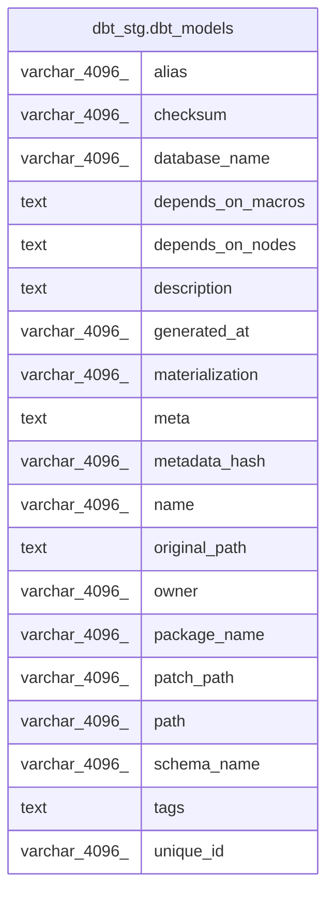

# dbt_stg.dbt_models

## Description

## Columns

| #  | Name              | Type          | Default | Nullable | Children | Parents | Comment |
| -- | ----------------- | ------------- | ------- | -------- | -------- | ------- | ------- |
| 1  | alias             | varchar(4096) |         | true     |          |         |         |
| 2  | checksum          | varchar(4096) |         | true     |          |         |         |
| 3  | database_name     | varchar(4096) |         | true     |          |         |         |
| 4  | depends_on_macros | text          |         | true     |          |         |         |
| 5  | depends_on_nodes  | text          |         | true     |          |         |         |
| 6  | description       | text          |         | true     |          |         |         |
| 7  | generated_at      | varchar(4096) |         | true     |          |         |         |
| 8  | materialization   | varchar(4096) |         | true     |          |         |         |
| 9  | meta              | text          |         | true     |          |         |         |
| 10 | metadata_hash     | varchar(4096) |         | true     |          |         |         |
| 11 | name              | varchar(4096) |         | true     |          |         |         |
| 12 | original_path     | text          |         | true     |          |         |         |
| 13 | owner             | varchar(4096) |         | true     |          |         |         |
| 14 | package_name      | varchar(4096) |         | true     |          |         |         |
| 15 | patch_path        | varchar(4096) |         | true     |          |         |         |
| 16 | path              | varchar(4096) |         | true     |          |         |         |
| 17 | schema_name       | varchar(4096) |         | true     |          |         |         |
| 18 | tags              | text          |         | true     |          |         |         |
| 19 | unique_id         | varchar(4096) |         | true     |          |         |         |

## Relations

---

> Generated by [tbls](https://github.com/k1LoW/tbls)
