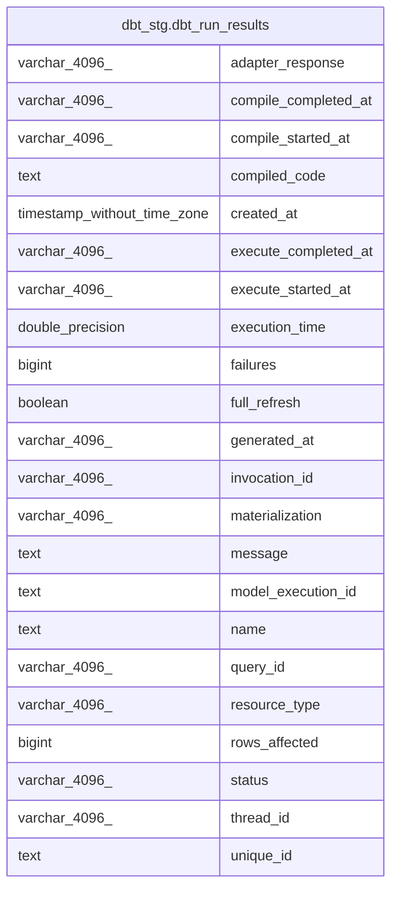

# dbt_stg.dbt_run_results

## Description

## Columns

| #  | Name                 | Type                        | Default | Nullable | Children | Parents | Comment |
| -- | -------------------- | --------------------------- | ------- | -------- | -------- | ------- | ------- |
| 1  | adapter_response     | varchar(4096)               |         | true     |          |         |         |
| 2  | compile_completed_at | varchar(4096)               |         | true     |          |         |         |
| 3  | compile_started_at   | varchar(4096)               |         | true     |          |         |         |
| 4  | compiled_code        | text                        |         | true     |          |         |         |
| 5  | created_at           | timestamp without time zone |         | true     |          |         |         |
| 6  | execute_completed_at | varchar(4096)               |         | true     |          |         |         |
| 7  | execute_started_at   | varchar(4096)               |         | true     |          |         |         |
| 8  | execution_time       | double precision            |         | true     |          |         |         |
| 9  | failures             | bigint                      |         | true     |          |         |         |
| 10 | full_refresh         | boolean                     |         | true     |          |         |         |
| 11 | generated_at         | varchar(4096)               |         | true     |          |         |         |
| 12 | invocation_id        | varchar(4096)               |         | true     |          |         |         |
| 13 | materialization      | varchar(4096)               |         | true     |          |         |         |
| 14 | message              | text                        |         | true     |          |         |         |
| 15 | model_execution_id   | text                        |         | true     |          |         |         |
| 16 | name                 | text                        |         | true     |          |         |         |
| 17 | query_id             | varchar(4096)               |         | true     |          |         |         |
| 18 | resource_type        | varchar(4096)               |         | true     |          |         |         |
| 19 | rows_affected        | bigint                      |         | true     |          |         |         |
| 20 | status               | varchar(4096)               |         | true     |          |         |         |
| 21 | thread_id            | varchar(4096)               |         | true     |          |         |         |
| 22 | unique_id            | text                        |         | true     |          |         |         |

## Relations

---

> Generated by [tbls](https://github.com/k1LoW/tbls)
