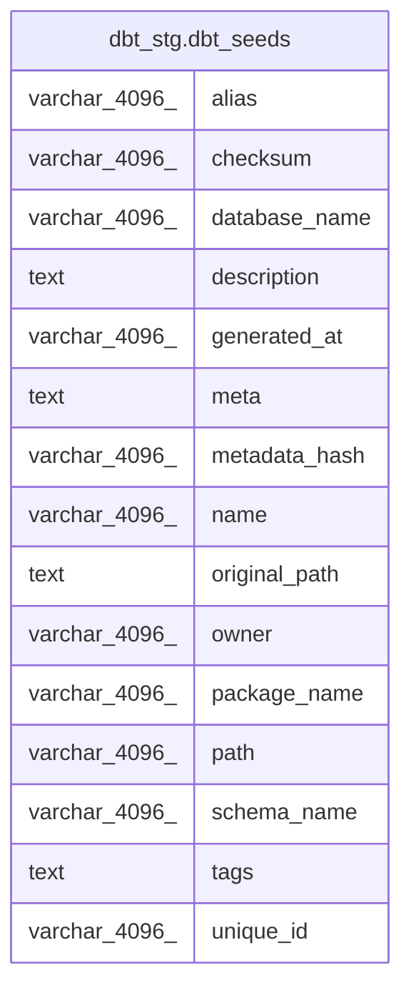

# dbt_stg.dbt_seeds

## Description

## Columns

| #  | Name          | Type          | Default | Nullable | Children | Parents | Comment |
| -- | ------------- | ------------- | ------- | -------- | -------- | ------- | ------- |
| 1  | alias         | varchar(4096) |         | true     |          |         |         |
| 2  | checksum      | varchar(4096) |         | true     |          |         |         |
| 3  | database_name | varchar(4096) |         | true     |          |         |         |
| 4  | description   | text          |         | true     |          |         |         |
| 5  | generated_at  | varchar(4096) |         | true     |          |         |         |
| 6  | meta          | text          |         | true     |          |         |         |
| 7  | metadata_hash | varchar(4096) |         | true     |          |         |         |
| 8  | name          | varchar(4096) |         | true     |          |         |         |
| 9  | original_path | text          |         | true     |          |         |         |
| 10 | owner         | varchar(4096) |         | true     |          |         |         |
| 11 | package_name  | varchar(4096) |         | true     |          |         |         |
| 12 | path          | varchar(4096) |         | true     |          |         |         |
| 13 | schema_name   | varchar(4096) |         | true     |          |         |         |
| 14 | tags          | text          |         | true     |          |         |         |
| 15 | unique_id     | varchar(4096) |         | true     |          |         |         |

## Relations

---

> Generated by [tbls](https://github.com/k1LoW/tbls)
