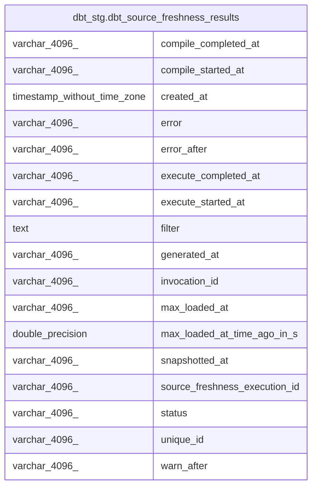

# dbt_stg.dbt_source_freshness_results

## Description

## Columns

| #  | Name                          | Type                        | Default | Nullable | Children | Parents | Comment |
| -- | ----------------------------- | --------------------------- | ------- | -------- | -------- | ------- | ------- |
| 1  | compile_completed_at          | varchar(4096)               |         | true     |          |         |         |
| 2  | compile_started_at            | varchar(4096)               |         | true     |          |         |         |
| 3  | created_at                    | timestamp without time zone |         | true     |          |         |         |
| 4  | error                         | varchar(4096)               |         | true     |          |         |         |
| 5  | error_after                   | varchar(4096)               |         | true     |          |         |         |
| 6  | execute_completed_at          | varchar(4096)               |         | true     |          |         |         |
| 7  | execute_started_at            | varchar(4096)               |         | true     |          |         |         |
| 8  | filter                        | text                        |         | true     |          |         |         |
| 9  | generated_at                  | varchar(4096)               |         | true     |          |         |         |
| 10 | invocation_id                 | varchar(4096)               |         | true     |          |         |         |
| 11 | max_loaded_at                 | varchar(4096)               |         | true     |          |         |         |
| 12 | max_loaded_at_time_ago_in_s   | double precision            |         | true     |          |         |         |
| 13 | snapshotted_at                | varchar(4096)               |         | true     |          |         |         |
| 14 | source_freshness_execution_id | varchar(4096)               |         | true     |          |         |         |
| 15 | status                        | varchar(4096)               |         | true     |          |         |         |
| 16 | unique_id                     | varchar(4096)               |         | true     |          |         |         |
| 17 | warn_after                    | varchar(4096)               |         | true     |          |         |         |

## Relations

---

> Generated by [tbls](https://github.com/k1LoW/tbls)
