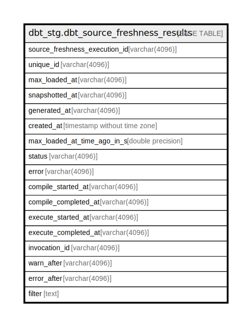

# dbt_stg.dbt_source_freshness_results

## Description

## Columns

| Name | Type | Default | Nullable | Children | Parents | Comment |
| ---- | ---- | ------- | -------- | -------- | ------- | ------- |
| source_freshness_execution_id | varchar(4096) |  | true |  |  |  |
| unique_id | varchar(4096) |  | true |  |  |  |
| max_loaded_at | varchar(4096) |  | true |  |  |  |
| snapshotted_at | varchar(4096) |  | true |  |  |  |
| generated_at | varchar(4096) |  | true |  |  |  |
| created_at | timestamp without time zone |  | true |  |  |  |
| max_loaded_at_time_ago_in_s | double precision |  | true |  |  |  |
| status | varchar(4096) |  | true |  |  |  |
| error | varchar(4096) |  | true |  |  |  |
| compile_started_at | varchar(4096) |  | true |  |  |  |
| compile_completed_at | varchar(4096) |  | true |  |  |  |
| execute_started_at | varchar(4096) |  | true |  |  |  |
| execute_completed_at | varchar(4096) |  | true |  |  |  |
| invocation_id | varchar(4096) |  | true |  |  |  |
| warn_after | varchar(4096) |  | true |  |  |  |
| error_after | varchar(4096) |  | true |  |  |  |
| filter | text |  | true |  |  |  |

## Relations

---

> Generated by [tbls](https://github.com/k1LoW/tbls)
