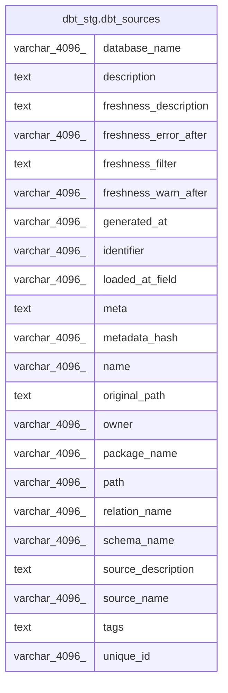

# dbt_stg.dbt_sources

## Description

## Columns

| #  | Name                  | Type          | Default | Nullable | Children | Parents | Comment |
| -- | --------------------- | ------------- | ------- | -------- | -------- | ------- | ------- |
| 1  | database_name         | varchar(4096) |         | true     |          |         |         |
| 2  | description           | text          |         | true     |          |         |         |
| 3  | freshness_description | text          |         | true     |          |         |         |
| 4  | freshness_error_after | varchar(4096) |         | true     |          |         |         |
| 5  | freshness_filter      | text          |         | true     |          |         |         |
| 6  | freshness_warn_after  | varchar(4096) |         | true     |          |         |         |
| 7  | generated_at          | varchar(4096) |         | true     |          |         |         |
| 8  | identifier            | varchar(4096) |         | true     |          |         |         |
| 9  | loaded_at_field       | varchar(4096) |         | true     |          |         |         |
| 10 | meta                  | text          |         | true     |          |         |         |
| 11 | metadata_hash         | varchar(4096) |         | true     |          |         |         |
| 12 | name                  | varchar(4096) |         | true     |          |         |         |
| 13 | original_path         | text          |         | true     |          |         |         |
| 14 | owner                 | varchar(4096) |         | true     |          |         |         |
| 15 | package_name          | varchar(4096) |         | true     |          |         |         |
| 16 | path                  | varchar(4096) |         | true     |          |         |         |
| 17 | relation_name         | varchar(4096) |         | true     |          |         |         |
| 18 | schema_name           | varchar(4096) |         | true     |          |         |         |
| 19 | source_description    | text          |         | true     |          |         |         |
| 20 | source_name           | varchar(4096) |         | true     |          |         |         |
| 21 | tags                  | text          |         | true     |          |         |         |
| 22 | unique_id             | varchar(4096) |         | true     |          |         |         |

## Relations

---

> Generated by [tbls](https://github.com/k1LoW/tbls)
