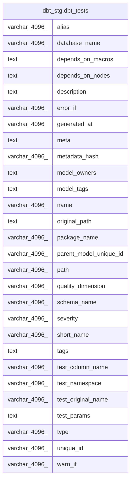

# dbt_stg.dbt_tests

## Description

## Columns

| #  | Name                   | Type          | Default | Nullable | Children | Parents | Comment |
| -- | ---------------------- | ------------- | ------- | -------- | -------- | ------- | ------- |
| 1  | alias                  | varchar(4096) |         | true     |          |         |         |
| 2  | database_name          | varchar(4096) |         | true     |          |         |         |
| 3  | depends_on_macros      | text          |         | true     |          |         |         |
| 4  | depends_on_nodes       | text          |         | true     |          |         |         |
| 5  | description            | text          |         | true     |          |         |         |
| 6  | error_if               | varchar(4096) |         | true     |          |         |         |
| 7  | generated_at           | varchar(4096) |         | true     |          |         |         |
| 8  | meta                   | text          |         | true     |          |         |         |
| 9  | metadata_hash          | varchar(4096) |         | true     |          |         |         |
| 10 | model_owners           | text          |         | true     |          |         |         |
| 11 | model_tags             | text          |         | true     |          |         |         |
| 12 | name                   | varchar(4096) |         | true     |          |         |         |
| 13 | original_path          | text          |         | true     |          |         |         |
| 14 | package_name           | varchar(4096) |         | true     |          |         |         |
| 15 | parent_model_unique_id | varchar(4096) |         | true     |          |         |         |
| 16 | path                   | varchar(4096) |         | true     |          |         |         |
| 17 | quality_dimension      | varchar(4096) |         | true     |          |         |         |
| 18 | schema_name            | varchar(4096) |         | true     |          |         |         |
| 19 | severity               | varchar(4096) |         | true     |          |         |         |
| 20 | short_name             | varchar(4096) |         | true     |          |         |         |
| 21 | tags                   | text          |         | true     |          |         |         |
| 22 | test_column_name       | varchar(4096) |         | true     |          |         |         |
| 23 | test_namespace         | varchar(4096) |         | true     |          |         |         |
| 24 | test_original_name     | varchar(4096) |         | true     |          |         |         |
| 25 | test_params            | text          |         | true     |          |         |         |
| 26 | type                   | varchar(4096) |         | true     |          |         |         |
| 27 | unique_id              | varchar(4096) |         | true     |          |         |         |
| 28 | warn_if                | varchar(4096) |         | true     |          |         |         |

## Relations

---

> Generated by [tbls](https://github.com/k1LoW/tbls)
