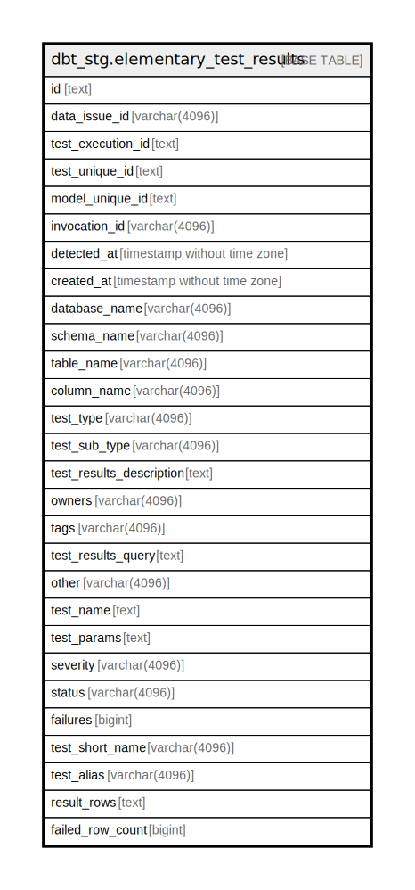

# dbt_stg.elementary_test_results

## Description

## Columns

| Name | Type | Default | Nullable | Children | Parents | Comment |
| ---- | ---- | ------- | -------- | -------- | ------- | ------- |
| id | text |  | true |  |  |  |
| data_issue_id | varchar(4096) |  | true |  |  |  |
| test_execution_id | text |  | true |  |  |  |
| test_unique_id | text |  | true |  |  |  |
| model_unique_id | text |  | true |  |  |  |
| invocation_id | varchar(4096) |  | true |  |  |  |
| detected_at | timestamp without time zone |  | true |  |  |  |
| created_at | timestamp without time zone |  | true |  |  |  |
| database_name | varchar(4096) |  | true |  |  |  |
| schema_name | varchar(4096) |  | true |  |  |  |
| table_name | varchar(4096) |  | true |  |  |  |
| column_name | varchar(4096) |  | true |  |  |  |
| test_type | varchar(4096) |  | true |  |  |  |
| test_sub_type | varchar(4096) |  | true |  |  |  |
| test_results_description | text |  | true |  |  |  |
| owners | varchar(4096) |  | true |  |  |  |
| tags | varchar(4096) |  | true |  |  |  |
| test_results_query | text |  | true |  |  |  |
| other | varchar(4096) |  | true |  |  |  |
| test_name | text |  | true |  |  |  |
| test_params | text |  | true |  |  |  |
| severity | varchar(4096) |  | true |  |  |  |
| status | varchar(4096) |  | true |  |  |  |
| failures | bigint |  | true |  |  |  |
| test_short_name | varchar(4096) |  | true |  |  |  |
| test_alias | varchar(4096) |  | true |  |  |  |
| result_rows | text |  | true |  |  |  |
| failed_row_count | bigint |  | true |  |  |  |

## Relations

---

> Generated by [tbls](https://github.com/k1LoW/tbls)
