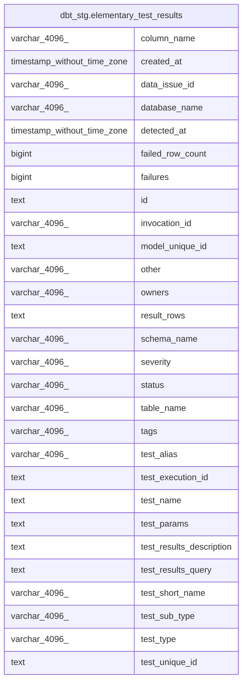

# dbt_stg.elementary_test_results

## Description

## Columns

| #  | Name                     | Type                        | Default | Nullable | Children | Parents | Comment |
| -- | ------------------------ | --------------------------- | ------- | -------- | -------- | ------- | ------- |
| 1  | column_name              | varchar(4096)               |         | true     |          |         |         |
| 2  | created_at               | timestamp without time zone |         | true     |          |         |         |
| 3  | data_issue_id            | varchar(4096)               |         | true     |          |         |         |
| 4  | database_name            | varchar(4096)               |         | true     |          |         |         |
| 5  | detected_at              | timestamp without time zone |         | true     |          |         |         |
| 6  | failed_row_count         | bigint                      |         | true     |          |         |         |
| 7  | failures                 | bigint                      |         | true     |          |         |         |
| 8  | id                       | text                        |         | true     |          |         |         |
| 9  | invocation_id            | varchar(4096)               |         | true     |          |         |         |
| 10 | model_unique_id          | text                        |         | true     |          |         |         |
| 11 | other                    | varchar(4096)               |         | true     |          |         |         |
| 12 | owners                   | varchar(4096)               |         | true     |          |         |         |
| 13 | result_rows              | text                        |         | true     |          |         |         |
| 14 | schema_name              | varchar(4096)               |         | true     |          |         |         |
| 15 | severity                 | varchar(4096)               |         | true     |          |         |         |
| 16 | status                   | varchar(4096)               |         | true     |          |         |         |
| 17 | table_name               | varchar(4096)               |         | true     |          |         |         |
| 18 | tags                     | varchar(4096)               |         | true     |          |         |         |
| 19 | test_alias               | varchar(4096)               |         | true     |          |         |         |
| 20 | test_execution_id        | text                        |         | true     |          |         |         |
| 21 | test_name                | text                        |         | true     |          |         |         |
| 22 | test_params              | text                        |         | true     |          |         |         |
| 23 | test_results_description | text                        |         | true     |          |         |         |
| 24 | test_results_query       | text                        |         | true     |          |         |         |
| 25 | test_short_name          | varchar(4096)               |         | true     |          |         |         |
| 26 | test_sub_type            | varchar(4096)               |         | true     |          |         |         |
| 27 | test_type                | varchar(4096)               |         | true     |          |         |         |
| 28 | test_unique_id           | text                        |         | true     |          |         |         |

## Relations

---

> Generated by [tbls](https://github.com/k1LoW/tbls)
