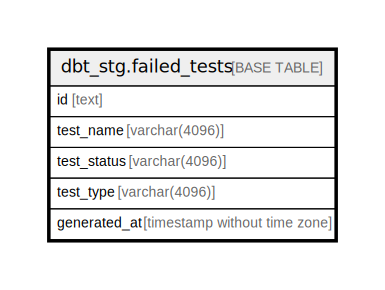

# dbt_stg.failed_tests

## Description

## Columns

| Name | Type | Default | Nullable | Children | Parents | Comment |
| ---- | ---- | ------- | -------- | -------- | ------- | ------- |
| id | text |  | true |  |  |  |
| test_name | varchar(4096) |  | true |  |  |  |
| test_status | varchar(4096) |  | true |  |  |  |
| test_type | varchar(4096) |  | true |  |  |  |
| generated_at | timestamp without time zone |  | true |  |  |  |

## Relations

---

> Generated by [tbls](https://github.com/k1LoW/tbls)
