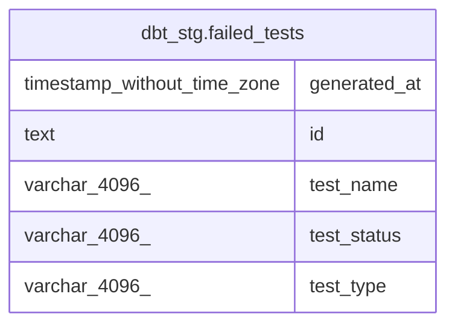

# dbt_stg.failed_tests

## Description

## Columns

| # | Name         | Type                        | Default | Nullable | Children | Parents | Comment |
| - | ------------ | --------------------------- | ------- | -------- | -------- | ------- | ------- |
| 1 | generated_at | timestamp without time zone |         | true     |          |         |         |
| 2 | id           | text                        |         | true     |          |         |         |
| 3 | test_name    | varchar(4096)               |         | true     |          |         |         |
| 4 | test_status  | varchar(4096)               |         | true     |          |         |         |
| 5 | test_type    | varchar(4096)               |         | true     |          |         |         |

## Relations

---

> Generated by [tbls](https://github.com/k1LoW/tbls)
