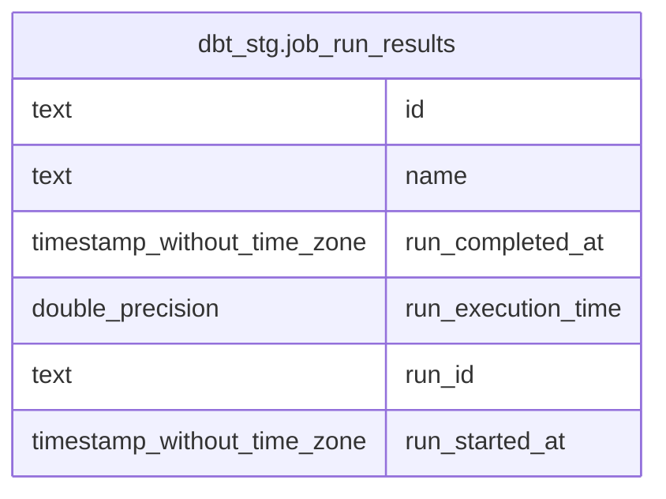

# dbt_stg.job_run_results

## Description

<details>
<summary><strong>Table Definition</strong></summary>

```sql
CREATE VIEW job_run_results AS (
 WITH jobs AS (
         SELECT dbt_invocations.job_name,
            dbt_invocations.job_id,
            dbt_invocations.job_run_id,
            min((dbt_invocations.run_started_at)::timestamp without time zone) AS job_run_started_at,
            max((dbt_invocations.run_completed_at)::timestamp without time zone) AS job_run_completed_at,
            ((((((((((((max((dbt_invocations.run_completed_at)::timestamp without time zone))::date - (min((dbt_invocations.run_started_at)::timestamp without time zone))::date) * 24))::double precision + date_part('hour'::text, max((dbt_invocations.run_completed_at)::timestamp without time zone))) - date_part('hour'::text, min((dbt_invocations.run_started_at)::timestamp without time zone))) * (60)::double precision) + date_part('minute'::text, max((dbt_invocations.run_completed_at)::timestamp without time zone))) - date_part('minute'::text, min((dbt_invocations.run_started_at)::timestamp without time zone))) * (60)::double precision) + floor(date_part('second'::text, max((dbt_invocations.run_completed_at)::timestamp without time zone)))) - floor(date_part('second'::text, min((dbt_invocations.run_started_at)::timestamp without time zone)))) AS job_run_execution_time
           FROM dbt_stg.dbt_invocations
          WHERE (dbt_invocations.job_id IS NOT NULL)
          GROUP BY dbt_invocations.job_name, dbt_invocations.job_id, dbt_invocations.job_run_id
        )
 SELECT job_name AS name,
    job_id AS id,
    job_run_id AS run_id,
    job_run_started_at AS run_started_at,
    job_run_completed_at AS run_completed_at,
    job_run_execution_time AS run_execution_time
   FROM jobs
)
```

</details>

## Columns

| # | Name               | Type                        | Default | Nullable | Children | Parents | Comment |
| - | ------------------ | --------------------------- | ------- | -------- | -------- | ------- | ------- |
| 1 | id                 | text                        |         | true     |          |         |         |
| 2 | name               | text                        |         | true     |          |         |         |
| 3 | run_completed_at   | timestamp without time zone |         | true     |          |         |         |
| 4 | run_execution_time | double precision            |         | true     |          |         |         |
| 5 | run_id             | text                        |         | true     |          |         |         |
| 6 | run_started_at     | timestamp without time zone |         | true     |          |         |         |

## Referenced Tables

| # | # | Name                                                  | Columns | Comment | Type       |
| - | - | ----------------------------------------------------- | ------- | ------- | ---------- |
| 1 | 1 | [dbt_stg.dbt_invocations](dbt_stg.dbt_invocations.md) | 35      |         | BASE TABLE |

## Relations



---

> Generated by [tbls](https://github.com/k1LoW/tbls)
