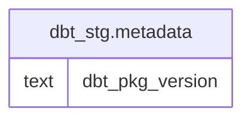

# dbt_stg.metadata

## Description

## Columns

| # | Name            | Type | Default | Nullable | Children | Parents | Comment |
| - | --------------- | ---- | ------- | -------- | -------- | ------- | ------- |
| 1 | dbt_pkg_version | text |         | true     |          |         |         |

## Relations

---

> Generated by [tbls](https://github.com/k1LoW/tbls)
