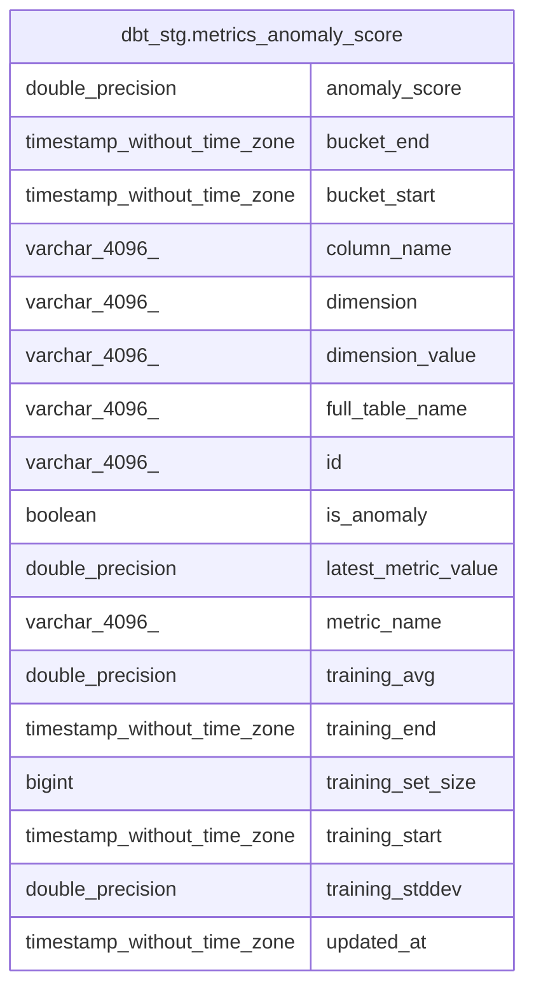

# dbt_stg.metrics_anomaly_score

## Description

<details>
<summary><strong>Table Definition</strong></summary>

```sql
CREATE VIEW metrics_anomaly_score AS (
 WITH data_monitoring_metrics AS (
         SELECT data_monitoring_metrics.id,
            data_monitoring_metrics.full_table_name,
            data_monitoring_metrics.column_name,
            data_monitoring_metrics.metric_name,
            data_monitoring_metrics.metric_type,
            data_monitoring_metrics.metric_value,
            data_monitoring_metrics.source_value,
            data_monitoring_metrics.bucket_start,
            data_monitoring_metrics.bucket_end,
            data_monitoring_metrics.bucket_duration_hours,
            data_monitoring_metrics.updated_at,
            data_monitoring_metrics.dimension,
            data_monitoring_metrics.dimension_value,
            data_monitoring_metrics.metric_properties,
            data_monitoring_metrics.created_at
           FROM dbt_stg.data_monitoring_metrics
        ), time_window_aggregation AS (
         SELECT data_monitoring_metrics.id,
            data_monitoring_metrics.full_table_name,
            data_monitoring_metrics.column_name,
            data_monitoring_metrics.dimension,
            data_monitoring_metrics.dimension_value,
            data_monitoring_metrics.metric_name,
            data_monitoring_metrics.metric_value,
            data_monitoring_metrics.source_value,
            data_monitoring_metrics.bucket_start,
            data_monitoring_metrics.bucket_end,
            data_monitoring_metrics.bucket_duration_hours,
            data_monitoring_metrics.updated_at,
            avg(data_monitoring_metrics.metric_value) OVER (PARTITION BY data_monitoring_metrics.metric_name, data_monitoring_metrics.full_table_name, data_monitoring_metrics.column_name ORDER BY data_monitoring_metrics.bucket_start ROWS BETWEEN UNBOUNDED PRECEDING AND CURRENT ROW) AS training_avg,
            stddev(data_monitoring_metrics.metric_value) OVER (PARTITION BY data_monitoring_metrics.metric_name, data_monitoring_metrics.full_table_name, data_monitoring_metrics.column_name ORDER BY data_monitoring_metrics.bucket_start ROWS BETWEEN UNBOUNDED PRECEDING AND CURRENT ROW) AS training_stddev,
            count(data_monitoring_metrics.metric_value) OVER (PARTITION BY data_monitoring_metrics.metric_name, data_monitoring_metrics.full_table_name, data_monitoring_metrics.column_name ORDER BY data_monitoring_metrics.bucket_start ROWS BETWEEN UNBOUNDED PRECEDING AND CURRENT ROW) AS training_set_size,
            last_value(data_monitoring_metrics.bucket_end) OVER (PARTITION BY data_monitoring_metrics.metric_name, data_monitoring_metrics.full_table_name, data_monitoring_metrics.column_name ORDER BY data_monitoring_metrics.bucket_start ROWS BETWEEN UNBOUNDED PRECEDING AND CURRENT ROW) AS training_end,
            first_value(data_monitoring_metrics.bucket_end) OVER (PARTITION BY data_monitoring_metrics.metric_name, data_monitoring_metrics.full_table_name, data_monitoring_metrics.column_name ORDER BY data_monitoring_metrics.bucket_start ROWS BETWEEN UNBOUNDED PRECEDING AND CURRENT ROW) AS training_start
           FROM data_monitoring_metrics
          GROUP BY data_monitoring_metrics.id, data_monitoring_metrics.full_table_name, data_monitoring_metrics.column_name, data_monitoring_metrics.dimension, data_monitoring_metrics.dimension_value, data_monitoring_metrics.metric_name, data_monitoring_metrics.metric_value, data_monitoring_metrics.source_value, data_monitoring_metrics.bucket_start, data_monitoring_metrics.bucket_end, data_monitoring_metrics.bucket_duration_hours, data_monitoring_metrics.updated_at
        ), metrics_anomaly_score AS (
         SELECT time_window_aggregation.id,
            time_window_aggregation.full_table_name,
            time_window_aggregation.column_name,
            time_window_aggregation.dimension,
            time_window_aggregation.dimension_value,
            time_window_aggregation.metric_name,
                CASE
                    WHEN (time_window_aggregation.training_stddev IS NULL) THEN NULL::double precision
                    WHEN (time_window_aggregation.training_stddev = (0)::double precision) THEN (0)::double precision
                    ELSE ((time_window_aggregation.metric_value - time_window_aggregation.training_avg) / time_window_aggregation.training_stddev)
                END AS anomaly_score,
            time_window_aggregation.metric_value AS latest_metric_value,
            time_window_aggregation.bucket_start,
            time_window_aggregation.bucket_end,
            time_window_aggregation.training_avg,
            time_window_aggregation.training_stddev,
            time_window_aggregation.training_start,
            time_window_aggregation.training_end,
            time_window_aggregation.training_set_size,
            max(time_window_aggregation.updated_at) AS updated_at
           FROM time_window_aggregation
          WHERE ((time_window_aggregation.metric_value IS NOT NULL) AND (time_window_aggregation.training_avg IS NOT NULL) AND (time_window_aggregation.bucket_end >= (date_trunc('day'::text, (CURRENT_TIMESTAMP)::timestamp without time zone) + (('-7'::integer)::double precision * '1 day'::interval))))
          GROUP BY time_window_aggregation.id, time_window_aggregation.full_table_name, time_window_aggregation.column_name, time_window_aggregation.dimension, time_window_aggregation.dimension_value, time_window_aggregation.metric_name,
                CASE
                    WHEN (time_window_aggregation.training_stddev IS NULL) THEN NULL::double precision
                    WHEN (time_window_aggregation.training_stddev = (0)::double precision) THEN (0)::double precision
                    ELSE ((time_window_aggregation.metric_value - time_window_aggregation.training_avg) / time_window_aggregation.training_stddev)
                END, time_window_aggregation.metric_value, time_window_aggregation.bucket_start, time_window_aggregation.bucket_end, time_window_aggregation.training_avg, time_window_aggregation.training_stddev, time_window_aggregation.training_start, time_window_aggregation.training_end, time_window_aggregation.training_set_size
          ORDER BY time_window_aggregation.bucket_end DESC
        ), final AS (
         SELECT metrics_anomaly_score.id,
            metrics_anomaly_score.full_table_name,
            metrics_anomaly_score.column_name,
            metrics_anomaly_score.dimension,
            metrics_anomaly_score.dimension_value,
            metrics_anomaly_score.metric_name,
            metrics_anomaly_score.anomaly_score,
            metrics_anomaly_score.latest_metric_value,
            metrics_anomaly_score.bucket_start,
            metrics_anomaly_score.bucket_end,
            metrics_anomaly_score.training_avg,
            metrics_anomaly_score.training_stddev,
            metrics_anomaly_score.training_start,
            metrics_anomaly_score.training_end,
            metrics_anomaly_score.training_set_size,
            metrics_anomaly_score.updated_at,
                CASE
                    WHEN (abs(metrics_anomaly_score.anomaly_score) > (3)::double precision) THEN true
                    ELSE false
                END AS is_anomaly
           FROM metrics_anomaly_score
        )
 SELECT id,
    full_table_name,
    column_name,
    dimension,
    dimension_value,
    metric_name,
    anomaly_score,
    latest_metric_value,
    bucket_start,
    bucket_end,
    training_avg,
    training_stddev,
    training_start,
    training_end,
    training_set_size,
    updated_at,
    is_anomaly
   FROM final
)
```

</details>

## Columns

| #  | Name                | Type                        | Default | Nullable | Children | Parents | Comment |
| -- | ------------------- | --------------------------- | ------- | -------- | -------- | ------- | ------- |
| 1  | anomaly_score       | double precision            |         | true     |          |         |         |
| 2  | bucket_end          | timestamp without time zone |         | true     |          |         |         |
| 3  | bucket_start        | timestamp without time zone |         | true     |          |         |         |
| 4  | column_name         | varchar(4096)               |         | true     |          |         |         |
| 5  | dimension           | varchar(4096)               |         | true     |          |         |         |
| 6  | dimension_value     | varchar(4096)               |         | true     |          |         |         |
| 7  | full_table_name     | varchar(4096)               |         | true     |          |         |         |
| 8  | id                  | varchar(4096)               |         | true     |          |         |         |
| 9  | is_anomaly          | boolean                     |         | true     |          |         |         |
| 10 | latest_metric_value | double precision            |         | true     |          |         |         |
| 11 | metric_name         | varchar(4096)               |         | true     |          |         |         |
| 12 | training_avg        | double precision            |         | true     |          |         |         |
| 13 | training_end        | timestamp without time zone |         | true     |          |         |         |
| 14 | training_set_size   | bigint                      |         | true     |          |         |         |
| 15 | training_start      | timestamp without time zone |         | true     |          |         |         |
| 16 | training_stddev     | double precision            |         | true     |          |         |         |
| 17 | updated_at          | timestamp without time zone |         | true     |          |         |         |

## Referenced Tables

| # | # | Name                                                                  | Columns | Comment | Type       |
| - | - | --------------------------------------------------------------------- | ------- | ------- | ---------- |
| 1 | 1 | [dbt_stg.data_monitoring_metrics](dbt_stg.data_monitoring_metrics.md) | 15      |         | BASE TABLE |
| 2 | 2 | [time_window_aggregation](time_window_aggregation.md)                 | 0       |         |            |
| 3 | 3 | [metrics_anomaly_score](metrics_anomaly_score.md)                     | 0       |         |            |
| 4 | 4 | [final](final.md)                                                     | 0       |         |            |

## Relations



---

> Generated by [tbls](https://github.com/k1LoW/tbls)
