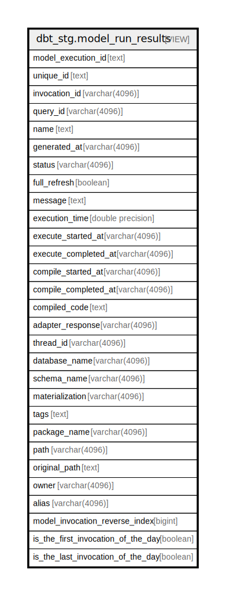

# dbt_stg.model_run_results

## Description

<details>
<summary><strong>Table Definition</strong></summary>

```sql
CREATE VIEW model_run_results AS (
 WITH dbt_run_results AS (
         SELECT dbt_run_results.model_execution_id,
            dbt_run_results.unique_id,
            dbt_run_results.invocation_id,
            dbt_run_results.generated_at,
            dbt_run_results.created_at,
            dbt_run_results.name,
            dbt_run_results.message,
            dbt_run_results.status,
            dbt_run_results.resource_type,
            dbt_run_results.execution_time,
            dbt_run_results.execute_started_at,
            dbt_run_results.execute_completed_at,
            dbt_run_results.compile_started_at,
            dbt_run_results.compile_completed_at,
            dbt_run_results.rows_affected,
            dbt_run_results.full_refresh,
            dbt_run_results.compiled_code,
            dbt_run_results.failures,
            dbt_run_results.query_id,
            dbt_run_results.thread_id,
            dbt_run_results.materialization,
            dbt_run_results.adapter_response
           FROM dbt_stg.dbt_run_results
        ), dbt_models AS (
         SELECT dbt_models.unique_id,
            dbt_models.alias,
            dbt_models.checksum,
            dbt_models.materialization,
            dbt_models.tags,
            dbt_models.meta,
            dbt_models.owner,
            dbt_models.database_name,
            dbt_models.schema_name,
            dbt_models.depends_on_macros,
            dbt_models.depends_on_nodes,
            dbt_models.description,
            dbt_models.name,
            dbt_models.package_name,
            dbt_models.original_path,
            dbt_models.path,
            dbt_models.patch_path,
            dbt_models.generated_at,
            dbt_models.metadata_hash
           FROM dbt_stg.dbt_models
        )
 SELECT run_results.model_execution_id,
    run_results.unique_id,
    run_results.invocation_id,
    run_results.query_id,
    run_results.name,
    run_results.generated_at,
    run_results.status,
    run_results.full_refresh,
    run_results.message,
    run_results.execution_time,
    run_results.execute_started_at,
    run_results.execute_completed_at,
    run_results.compile_started_at,
    run_results.compile_completed_at,
    run_results.compiled_code,
    run_results.adapter_response,
    run_results.thread_id,
    models.database_name,
    models.schema_name,
    COALESCE(run_results.materialization, models.materialization) AS materialization,
    models.tags,
    models.package_name,
    models.path,
    models.original_path,
    models.owner,
    models.alias,
    row_number() OVER (PARTITION BY run_results.unique_id ORDER BY run_results.generated_at DESC) AS model_invocation_reverse_index,
        CASE
            WHEN ((first_value(run_results.invocation_id) OVER (PARTITION BY (date_trunc('day'::text, (run_results.generated_at)::timestamp without time zone)) ORDER BY run_results.generated_at ROWS BETWEEN UNBOUNDED PRECEDING AND UNBOUNDED FOLLOWING))::text = (run_results.invocation_id)::text) THEN true
            ELSE false
        END AS is_the_first_invocation_of_the_day,
        CASE
            WHEN ((last_value(run_results.invocation_id) OVER (PARTITION BY (date_trunc('day'::text, (run_results.generated_at)::timestamp without time zone)) ORDER BY run_results.generated_at ROWS BETWEEN UNBOUNDED PRECEDING AND UNBOUNDED FOLLOWING))::text = (run_results.invocation_id)::text) THEN true
            ELSE false
        END AS is_the_last_invocation_of_the_day
   FROM (dbt_run_results run_results
     JOIN dbt_models models ON ((run_results.unique_id = (models.unique_id)::text)))
)
```

</details>

## Columns

| Name | Type | Default | Nullable | Children | Parents | Comment |
| ---- | ---- | ------- | -------- | -------- | ------- | ------- |
| model_execution_id | text |  | true |  |  |  |
| unique_id | text |  | true |  |  |  |
| invocation_id | varchar(4096) |  | true |  |  |  |
| query_id | varchar(4096) |  | true |  |  |  |
| name | text |  | true |  |  |  |
| generated_at | varchar(4096) |  | true |  |  |  |
| status | varchar(4096) |  | true |  |  |  |
| full_refresh | boolean |  | true |  |  |  |
| message | text |  | true |  |  |  |
| execution_time | double precision |  | true |  |  |  |
| execute_started_at | varchar(4096) |  | true |  |  |  |
| execute_completed_at | varchar(4096) |  | true |  |  |  |
| compile_started_at | varchar(4096) |  | true |  |  |  |
| compile_completed_at | varchar(4096) |  | true |  |  |  |
| compiled_code | text |  | true |  |  |  |
| adapter_response | varchar(4096) |  | true |  |  |  |
| thread_id | varchar(4096) |  | true |  |  |  |
| database_name | varchar(4096) |  | true |  |  |  |
| schema_name | varchar(4096) |  | true |  |  |  |
| materialization | varchar(4096) |  | true |  |  |  |
| tags | text |  | true |  |  |  |
| package_name | varchar(4096) |  | true |  |  |  |
| path | varchar(4096) |  | true |  |  |  |
| original_path | text |  | true |  |  |  |
| owner | varchar(4096) |  | true |  |  |  |
| alias | varchar(4096) |  | true |  |  |  |
| model_invocation_reverse_index | bigint |  | true |  |  |  |
| is_the_first_invocation_of_the_day | boolean |  | true |  |  |  |
| is_the_last_invocation_of_the_day | boolean |  | true |  |  |  |

## Referenced Tables

| Name | Columns | Comment | Type |
| ---- | ------- | ------- | ---- |
| [dbt_stg.dbt_run_results](dbt_stg.dbt_run_results.md) | 22 |  | BASE TABLE |
| [dbt_stg.dbt_models](dbt_stg.dbt_models.md) | 19 |  | BASE TABLE |
| [dbt_models](dbt_models.md) | 0 |  |  |

## Relations



---

> Generated by [tbls](https://github.com/k1LoW/tbls)
