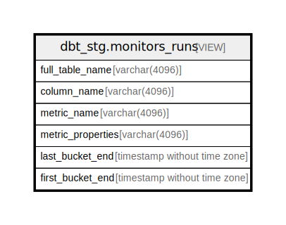

# dbt_stg.monitors_runs

## Description

<details>
<summary><strong>Table Definition</strong></summary>

```sql
CREATE VIEW monitors_runs AS (
 WITH data_monitoring_metrics AS (
         SELECT data_monitoring_metrics.id,
            data_monitoring_metrics.full_table_name,
            data_monitoring_metrics.column_name,
            data_monitoring_metrics.metric_name,
            data_monitoring_metrics.metric_type,
            data_monitoring_metrics.metric_value,
            data_monitoring_metrics.source_value,
            data_monitoring_metrics.bucket_start,
            data_monitoring_metrics.bucket_end,
            data_monitoring_metrics.bucket_duration_hours,
            data_monitoring_metrics.updated_at,
            data_monitoring_metrics.dimension,
            data_monitoring_metrics.dimension_value,
            data_monitoring_metrics.metric_properties,
            data_monitoring_metrics.created_at
           FROM dbt_stg.data_monitoring_metrics
        ), max_bucket_end AS (
         SELECT data_monitoring_metrics.full_table_name,
            data_monitoring_metrics.column_name,
            data_monitoring_metrics.metric_name,
            data_monitoring_metrics.metric_properties,
            max(data_monitoring_metrics.bucket_end) AS last_bucket_end,
            min(data_monitoring_metrics.bucket_end) AS first_bucket_end
           FROM data_monitoring_metrics
          GROUP BY data_monitoring_metrics.full_table_name, data_monitoring_metrics.column_name, data_monitoring_metrics.metric_name, data_monitoring_metrics.metric_properties
        )
 SELECT full_table_name,
    column_name,
    metric_name,
    metric_properties,
    last_bucket_end,
    first_bucket_end
   FROM max_bucket_end
)
```

</details>

## Columns

| Name | Type | Default | Nullable | Children | Parents | Comment |
| ---- | ---- | ------- | -------- | -------- | ------- | ------- |
| full_table_name | varchar(4096) |  | true |  |  |  |
| column_name | varchar(4096) |  | true |  |  |  |
| metric_name | varchar(4096) |  | true |  |  |  |
| metric_properties | varchar(4096) |  | true |  |  |  |
| last_bucket_end | timestamp without time zone |  | true |  |  |  |
| first_bucket_end | timestamp without time zone |  | true |  |  |  |

## Referenced Tables

| Name | Columns | Comment | Type |
| ---- | ------- | ------- | ---- |
| [dbt_stg.data_monitoring_metrics](dbt_stg.data_monitoring_metrics.md) | 15 |  | BASE TABLE |
| [max_bucket_end](max_bucket_end.md) | 0 |  |  |

## Relations



---

> Generated by [tbls](https://github.com/k1LoW/tbls)
