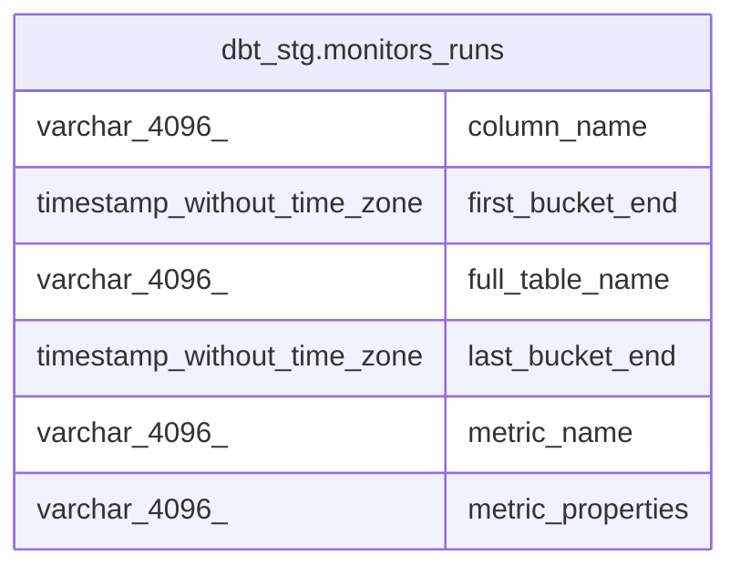

# dbt_stg.monitors_runs

## Description

<details>
<summary><strong>Table Definition</strong></summary>

```sql
CREATE VIEW monitors_runs AS (
 WITH data_monitoring_metrics AS (
         SELECT data_monitoring_metrics.id,
            data_monitoring_metrics.full_table_name,
            data_monitoring_metrics.column_name,
            data_monitoring_metrics.metric_name,
            data_monitoring_metrics.metric_type,
            data_monitoring_metrics.metric_value,
            data_monitoring_metrics.source_value,
            data_monitoring_metrics.bucket_start,
            data_monitoring_metrics.bucket_end,
            data_monitoring_metrics.bucket_duration_hours,
            data_monitoring_metrics.updated_at,
            data_monitoring_metrics.dimension,
            data_monitoring_metrics.dimension_value,
            data_monitoring_metrics.metric_properties,
            data_monitoring_metrics.created_at
           FROM dbt_stg.data_monitoring_metrics
        ), max_bucket_end AS (
         SELECT data_monitoring_metrics.full_table_name,
            data_monitoring_metrics.column_name,
            data_monitoring_metrics.metric_name,
            data_monitoring_metrics.metric_properties,
            max(data_monitoring_metrics.bucket_end) AS last_bucket_end,
            min(data_monitoring_metrics.bucket_end) AS first_bucket_end
           FROM data_monitoring_metrics
          GROUP BY data_monitoring_metrics.full_table_name, data_monitoring_metrics.column_name, data_monitoring_metrics.metric_name, data_monitoring_metrics.metric_properties
        )
 SELECT full_table_name,
    column_name,
    metric_name,
    metric_properties,
    last_bucket_end,
    first_bucket_end
   FROM max_bucket_end
)
```

</details>

## Columns

| # | Name              | Type                        | Default | Nullable | Children | Parents | Comment |
| - | ----------------- | --------------------------- | ------- | -------- | -------- | ------- | ------- |
| 1 | column_name       | varchar(4096)               |         | true     |          |         |         |
| 2 | first_bucket_end  | timestamp without time zone |         | true     |          |         |         |
| 3 | full_table_name   | varchar(4096)               |         | true     |          |         |         |
| 4 | last_bucket_end   | timestamp without time zone |         | true     |          |         |         |
| 5 | metric_name       | varchar(4096)               |         | true     |          |         |         |
| 6 | metric_properties | varchar(4096)               |         | true     |          |         |         |

## Referenced Tables

| # | # | Name                                                                  | Columns | Comment | Type       |
| - | - | --------------------------------------------------------------------- | ------- | ------- | ---------- |
| 1 | 1 | [dbt_stg.data_monitoring_metrics](dbt_stg.data_monitoring_metrics.md) | 15      |         | BASE TABLE |
| 2 | 2 | [max_bucket_end](max_bucket_end.md)                                   | 0       |         |            |

## Relations



---

> Generated by [tbls](https://github.com/k1LoW/tbls)
