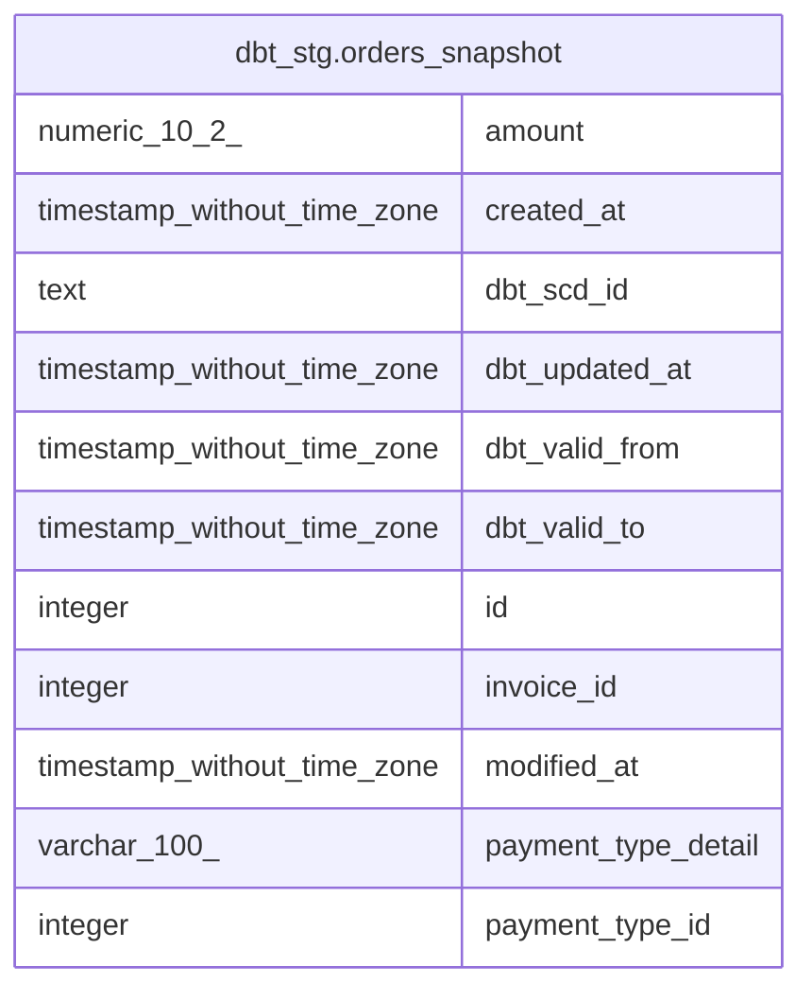

# dbt_stg.orders_snapshot

## Description

## Columns

| #  | Name                | Type                        | Default | Nullable | Children | Parents | Comment |
| -- | ------------------- | --------------------------- | ------- | -------- | -------- | ------- | ------- |
| 1  | amount              | numeric(10,2)               |         | true     |          |         |         |
| 2  | created_at          | timestamp without time zone |         | true     |          |         |         |
| 3  | dbt_scd_id          | text                        |         | true     |          |         |         |
| 4  | dbt_updated_at      | timestamp without time zone |         | true     |          |         |         |
| 5  | dbt_valid_from      | timestamp without time zone |         | true     |          |         |         |
| 6  | dbt_valid_to        | timestamp without time zone |         | true     |          |         |         |
| 7  | id                  | integer                     |         | true     |          |         |         |
| 8  | invoice_id          | integer                     |         | true     |          |         |         |
| 9  | modified_at         | timestamp without time zone |         | true     |          |         |         |
| 10 | payment_type_detail | varchar(100)                |         | true     |          |         |         |
| 11 | payment_type_id     | integer                     |         | true     |          |         |         |

## Relations

---

> Generated by [tbls](https://github.com/k1LoW/tbls)
