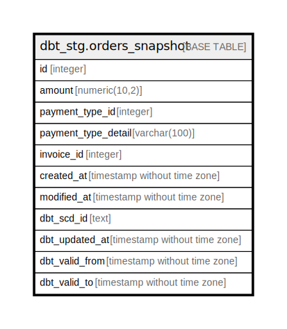

# dbt_stg.orders_snapshot

## Description

## Columns

| Name | Type | Default | Nullable | Children | Parents | Comment |
| ---- | ---- | ------- | -------- | -------- | ------- | ------- |
| id | integer |  | true |  |  |  |
| amount | numeric(10,2) |  | true |  |  |  |
| payment_type_id | integer |  | true |  |  |  |
| payment_type_detail | varchar(100) |  | true |  |  |  |
| invoice_id | integer |  | true |  |  |  |
| created_at | timestamp without time zone |  | true |  |  |  |
| modified_at | timestamp without time zone |  | true |  |  |  |
| dbt_scd_id | text |  | true |  |  |  |
| dbt_updated_at | timestamp without time zone |  | true |  |  |  |
| dbt_valid_from | timestamp without time zone |  | true |  |  |  |
| dbt_valid_to | timestamp without time zone |  | true |  |  |  |

## Relations

---

> Generated by [tbls](https://github.com/k1LoW/tbls)
