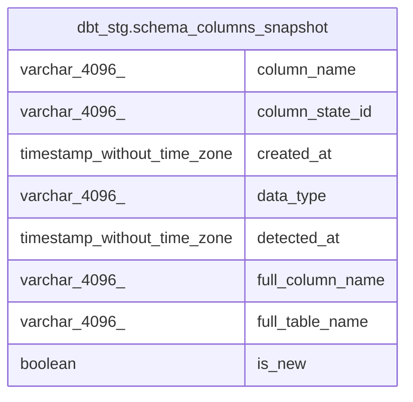

# dbt_stg.schema_columns_snapshot

## Description

## Columns

| # | Name             | Type                        | Default | Nullable | Children | Parents | Comment |
| - | ---------------- | --------------------------- | ------- | -------- | -------- | ------- | ------- |
| 1 | column_name      | varchar(4096)               |         | true     |          |         |         |
| 2 | column_state_id  | varchar(4096)               |         | true     |          |         |         |
| 3 | created_at       | timestamp without time zone |         | true     |          |         |         |
| 4 | data_type        | varchar(4096)               |         | true     |          |         |         |
| 5 | detected_at      | timestamp without time zone |         | true     |          |         |         |
| 6 | full_column_name | varchar(4096)               |         | true     |          |         |         |
| 7 | full_table_name  | varchar(4096)               |         | true     |          |         |         |
| 8 | is_new           | boolean                     |         | true     |          |         |         |

## Relations

---

> Generated by [tbls](https://github.com/k1LoW/tbls)
