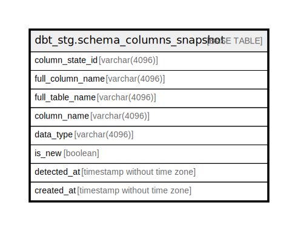

# dbt_stg.schema_columns_snapshot

## Description

## Columns

| Name | Type | Default | Nullable | Children | Parents | Comment |
| ---- | ---- | ------- | -------- | -------- | ------- | ------- |
| column_state_id | varchar(4096) |  | true |  |  |  |
| full_column_name | varchar(4096) |  | true |  |  |  |
| full_table_name | varchar(4096) |  | true |  |  |  |
| column_name | varchar(4096) |  | true |  |  |  |
| data_type | varchar(4096) |  | true |  |  |  |
| is_new | boolean |  | true |  |  |  |
| detected_at | timestamp without time zone |  | true |  |  |  |
| created_at | timestamp without time zone |  | true |  |  |  |

## Relations

---

> Generated by [tbls](https://github.com/k1LoW/tbls)
