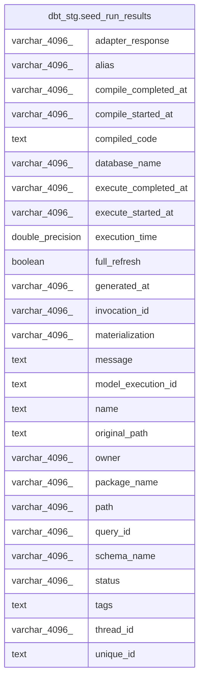

# dbt_stg.seed_run_results

## Description

<details>
<summary><strong>Table Definition</strong></summary>

```sql
CREATE VIEW seed_run_results AS (
 WITH dbt_run_results AS (
         SELECT dbt_run_results.model_execution_id,
            dbt_run_results.unique_id,
            dbt_run_results.invocation_id,
            dbt_run_results.generated_at,
            dbt_run_results.created_at,
            dbt_run_results.name,
            dbt_run_results.message,
            dbt_run_results.status,
            dbt_run_results.resource_type,
            dbt_run_results.execution_time,
            dbt_run_results.execute_started_at,
            dbt_run_results.execute_completed_at,
            dbt_run_results.compile_started_at,
            dbt_run_results.compile_completed_at,
            dbt_run_results.rows_affected,
            dbt_run_results.full_refresh,
            dbt_run_results.compiled_code,
            dbt_run_results.failures,
            dbt_run_results.query_id,
            dbt_run_results.thread_id,
            dbt_run_results.materialization,
            dbt_run_results.adapter_response
           FROM dbt_stg.dbt_run_results
        ), dbt_seeds AS (
         SELECT dbt_seeds.unique_id,
            dbt_seeds.alias,
            dbt_seeds.checksum,
            dbt_seeds.tags,
            dbt_seeds.meta,
            dbt_seeds.owner,
            dbt_seeds.database_name,
            dbt_seeds.schema_name,
            dbt_seeds.description,
            dbt_seeds.name,
            dbt_seeds.package_name,
            dbt_seeds.original_path,
            dbt_seeds.path,
            dbt_seeds.generated_at,
            dbt_seeds.metadata_hash
           FROM dbt_stg.dbt_seeds
        )
 SELECT run_results.model_execution_id,
    run_results.unique_id,
    run_results.invocation_id,
    run_results.query_id,
    run_results.name,
    run_results.generated_at,
    run_results.status,
    run_results.full_refresh,
    run_results.message,
    run_results.execution_time,
    run_results.execute_started_at,
    run_results.execute_completed_at,
    run_results.compile_started_at,
    run_results.compile_completed_at,
    run_results.compiled_code,
    run_results.adapter_response,
    run_results.thread_id,
    seeds.database_name,
    seeds.schema_name,
    run_results.materialization,
    seeds.tags,
    seeds.package_name,
    seeds.path,
    seeds.original_path,
    seeds.owner,
    seeds.alias
   FROM (dbt_run_results run_results
     JOIN dbt_seeds seeds ON ((run_results.unique_id = (seeds.unique_id)::text)))
)
```

</details>

## Columns

| #  | Name                 | Type             | Default | Nullable | Children | Parents | Comment |
| -- | -------------------- | ---------------- | ------- | -------- | -------- | ------- | ------- |
| 1  | adapter_response     | varchar(4096)    |         | true     |          |         |         |
| 2  | alias                | varchar(4096)    |         | true     |          |         |         |
| 3  | compile_completed_at | varchar(4096)    |         | true     |          |         |         |
| 4  | compile_started_at   | varchar(4096)    |         | true     |          |         |         |
| 5  | compiled_code        | text             |         | true     |          |         |         |
| 6  | database_name        | varchar(4096)    |         | true     |          |         |         |
| 7  | execute_completed_at | varchar(4096)    |         | true     |          |         |         |
| 8  | execute_started_at   | varchar(4096)    |         | true     |          |         |         |
| 9  | execution_time       | double precision |         | true     |          |         |         |
| 10 | full_refresh         | boolean          |         | true     |          |         |         |
| 11 | generated_at         | varchar(4096)    |         | true     |          |         |         |
| 12 | invocation_id        | varchar(4096)    |         | true     |          |         |         |
| 13 | materialization      | varchar(4096)    |         | true     |          |         |         |
| 14 | message              | text             |         | true     |          |         |         |
| 15 | model_execution_id   | text             |         | true     |          |         |         |
| 16 | name                 | text             |         | true     |          |         |         |
| 17 | original_path        | text             |         | true     |          |         |         |
| 18 | owner                | varchar(4096)    |         | true     |          |         |         |
| 19 | package_name         | varchar(4096)    |         | true     |          |         |         |
| 20 | path                 | varchar(4096)    |         | true     |          |         |         |
| 21 | query_id             | varchar(4096)    |         | true     |          |         |         |
| 22 | schema_name          | varchar(4096)    |         | true     |          |         |         |
| 23 | status               | varchar(4096)    |         | true     |          |         |         |
| 24 | tags                 | text             |         | true     |          |         |         |
| 25 | thread_id            | varchar(4096)    |         | true     |          |         |         |
| 26 | unique_id            | text             |         | true     |          |         |         |

## Referenced Tables

| # | # | Name                                                  | Columns | Comment | Type       |
| - | - | ----------------------------------------------------- | ------- | ------- | ---------- |
| 1 | 1 | [dbt_stg.dbt_run_results](dbt_stg.dbt_run_results.md) | 22      |         | BASE TABLE |
| 2 | 2 | [dbt_stg.dbt_seeds](dbt_stg.dbt_seeds.md)             | 15      |         | BASE TABLE |
| 3 | 3 | [dbt_seeds](dbt_seeds.md)                             | 0       |         |            |

## Relations



---

> Generated by [tbls](https://github.com/k1LoW/tbls)
