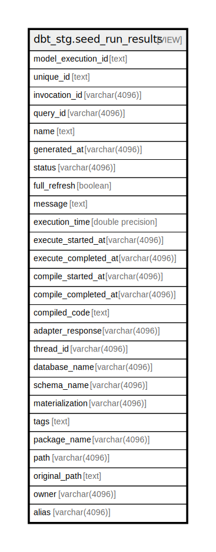

# dbt_stg.seed_run_results

## Description

<details>
<summary><strong>Table Definition</strong></summary>

```sql
CREATE VIEW seed_run_results AS (
 WITH dbt_run_results AS (
         SELECT dbt_run_results.model_execution_id,
            dbt_run_results.unique_id,
            dbt_run_results.invocation_id,
            dbt_run_results.generated_at,
            dbt_run_results.created_at,
            dbt_run_results.name,
            dbt_run_results.message,
            dbt_run_results.status,
            dbt_run_results.resource_type,
            dbt_run_results.execution_time,
            dbt_run_results.execute_started_at,
            dbt_run_results.execute_completed_at,
            dbt_run_results.compile_started_at,
            dbt_run_results.compile_completed_at,
            dbt_run_results.rows_affected,
            dbt_run_results.full_refresh,
            dbt_run_results.compiled_code,
            dbt_run_results.failures,
            dbt_run_results.query_id,
            dbt_run_results.thread_id,
            dbt_run_results.materialization,
            dbt_run_results.adapter_response
           FROM dbt_stg.dbt_run_results
        ), dbt_seeds AS (
         SELECT dbt_seeds.unique_id,
            dbt_seeds.alias,
            dbt_seeds.checksum,
            dbt_seeds.tags,
            dbt_seeds.meta,
            dbt_seeds.owner,
            dbt_seeds.database_name,
            dbt_seeds.schema_name,
            dbt_seeds.description,
            dbt_seeds.name,
            dbt_seeds.package_name,
            dbt_seeds.original_path,
            dbt_seeds.path,
            dbt_seeds.generated_at,
            dbt_seeds.metadata_hash
           FROM dbt_stg.dbt_seeds
        )
 SELECT run_results.model_execution_id,
    run_results.unique_id,
    run_results.invocation_id,
    run_results.query_id,
    run_results.name,
    run_results.generated_at,
    run_results.status,
    run_results.full_refresh,
    run_results.message,
    run_results.execution_time,
    run_results.execute_started_at,
    run_results.execute_completed_at,
    run_results.compile_started_at,
    run_results.compile_completed_at,
    run_results.compiled_code,
    run_results.adapter_response,
    run_results.thread_id,
    seeds.database_name,
    seeds.schema_name,
    run_results.materialization,
    seeds.tags,
    seeds.package_name,
    seeds.path,
    seeds.original_path,
    seeds.owner,
    seeds.alias
   FROM (dbt_run_results run_results
     JOIN dbt_seeds seeds ON ((run_results.unique_id = (seeds.unique_id)::text)))
)
```

</details>

## Columns

| Name | Type | Default | Nullable | Children | Parents | Comment |
| ---- | ---- | ------- | -------- | -------- | ------- | ------- |
| model_execution_id | text |  | true |  |  |  |
| unique_id | text |  | true |  |  |  |
| invocation_id | varchar(4096) |  | true |  |  |  |
| query_id | varchar(4096) |  | true |  |  |  |
| name | text |  | true |  |  |  |
| generated_at | varchar(4096) |  | true |  |  |  |
| status | varchar(4096) |  | true |  |  |  |
| full_refresh | boolean |  | true |  |  |  |
| message | text |  | true |  |  |  |
| execution_time | double precision |  | true |  |  |  |
| execute_started_at | varchar(4096) |  | true |  |  |  |
| execute_completed_at | varchar(4096) |  | true |  |  |  |
| compile_started_at | varchar(4096) |  | true |  |  |  |
| compile_completed_at | varchar(4096) |  | true |  |  |  |
| compiled_code | text |  | true |  |  |  |
| adapter_response | varchar(4096) |  | true |  |  |  |
| thread_id | varchar(4096) |  | true |  |  |  |
| database_name | varchar(4096) |  | true |  |  |  |
| schema_name | varchar(4096) |  | true |  |  |  |
| materialization | varchar(4096) |  | true |  |  |  |
| tags | text |  | true |  |  |  |
| package_name | varchar(4096) |  | true |  |  |  |
| path | varchar(4096) |  | true |  |  |  |
| original_path | text |  | true |  |  |  |
| owner | varchar(4096) |  | true |  |  |  |
| alias | varchar(4096) |  | true |  |  |  |

## Referenced Tables

| Name | Columns | Comment | Type |
| ---- | ------- | ------- | ---- |
| [dbt_stg.dbt_run_results](dbt_stg.dbt_run_results.md) | 22 |  | BASE TABLE |
| [dbt_stg.dbt_seeds](dbt_stg.dbt_seeds.md) | 15 |  | BASE TABLE |
| [dbt_seeds](dbt_seeds.md) | 0 |  |  |

## Relations



---

> Generated by [tbls](https://github.com/k1LoW/tbls)
