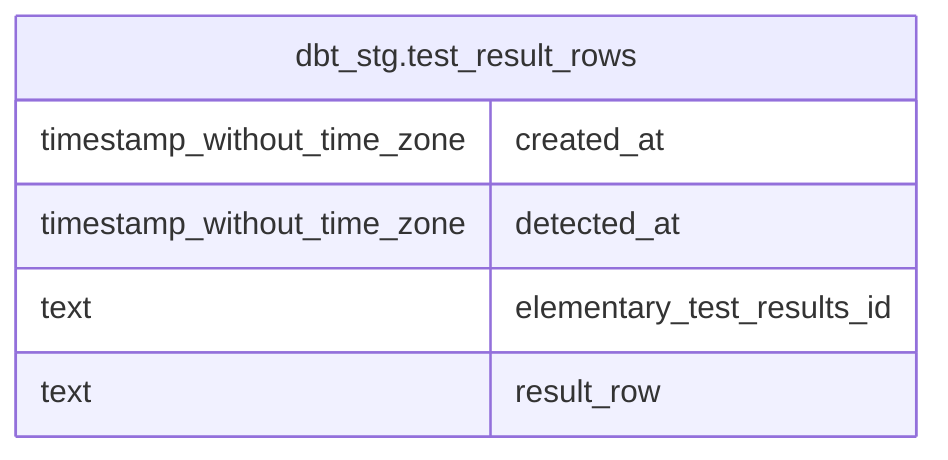

# dbt_stg.test_result_rows

## Description

## Columns

| # | Name                       | Type                        | Default | Nullable | Children | Parents | Comment |
| - | -------------------------- | --------------------------- | ------- | -------- | -------- | ------- | ------- |
| 1 | created_at                 | timestamp without time zone |         | true     |          |         |         |
| 2 | detected_at                | timestamp without time zone |         | true     |          |         |         |
| 3 | elementary_test_results_id | text                        |         | true     |          |         |         |
| 4 | result_row                 | text                        |         | true     |          |         |         |

## Indexes

| # | Name                             | Definition                                                                                         |
| - | -------------------------------- | -------------------------------------------------------------------------------------------------- |
| 1 | e06a743cb6d56d5380b833093b7d7c01 | CREATE INDEX e06a743cb6d56d5380b833093b7d7c01 ON dbt_stg.test_result_rows USING btree (created_at) |

## Relations

---

> Generated by [tbls](https://github.com/k1LoW/tbls)
