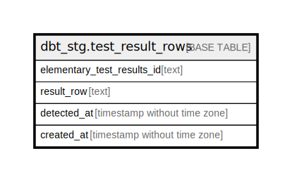

# dbt_stg.test_result_rows

## Description

## Columns

| Name | Type | Default | Nullable | Children | Parents | Comment |
| ---- | ---- | ------- | -------- | -------- | ------- | ------- |
| elementary_test_results_id | text |  | true |  |  |  |
| result_row | text |  | true |  |  |  |
| detected_at | timestamp without time zone |  | true |  |  |  |
| created_at | timestamp without time zone |  | true |  |  |  |

## Indexes

| Name | Definition |
| ---- | ---------- |
| 9e794d8f4662a0b3561fd431c2211d80 | CREATE INDEX "9e794d8f4662a0b3561fd431c2211d80" ON dbt_stg.test_result_rows USING btree (created_at) |

## Relations

---

> Generated by [tbls](https://github.com/k1LoW/tbls)
