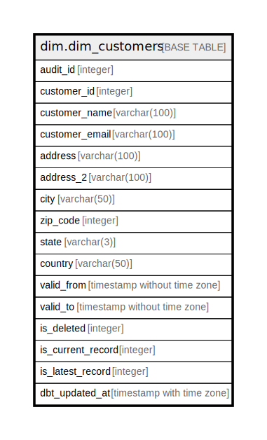

# dim.dim_customers

## Description

## Columns

| Name | Type | Default | Nullable | Children | Parents | Comment |
| ---- | ---- | ------- | -------- | -------- | ------- | ------- |
| audit_id | integer |  | true |  |  |  |
| customer_id | integer |  | true |  |  |  |
| customer_name | varchar(100) |  | true |  |  |  |
| customer_email | varchar(100) |  | true |  |  |  |
| address | varchar(100) |  | true |  |  |  |
| address_2 | varchar(100) |  | true |  |  |  |
| city | varchar(50) |  | true |  |  |  |
| zip_code | integer |  | true |  |  |  |
| state | varchar(3) |  | true |  |  |  |
| country | varchar(50) |  | true |  |  |  |
| valid_from | timestamp without time zone |  | true |  |  |  |
| valid_to | timestamp without time zone |  | true |  |  |  |
| is_deleted | integer |  | true |  |  |  |
| is_current_record | integer |  | true |  |  |  |
| is_latest_record | integer |  | true |  |  |  |
| dbt_updated_at | timestamp with time zone |  | true |  |  |  |

## Indexes

| Name | Definition |
| ---- | ---------- |
| 7755dcb248a8c45da6bbb9e2c1ef1603 | CREATE INDEX "7755dcb248a8c45da6bbb9e2c1ef1603" ON dim.dim_customers USING btree (customer_id) |

## Relations

---

> Generated by [tbls](https://github.com/k1LoW/tbls)
