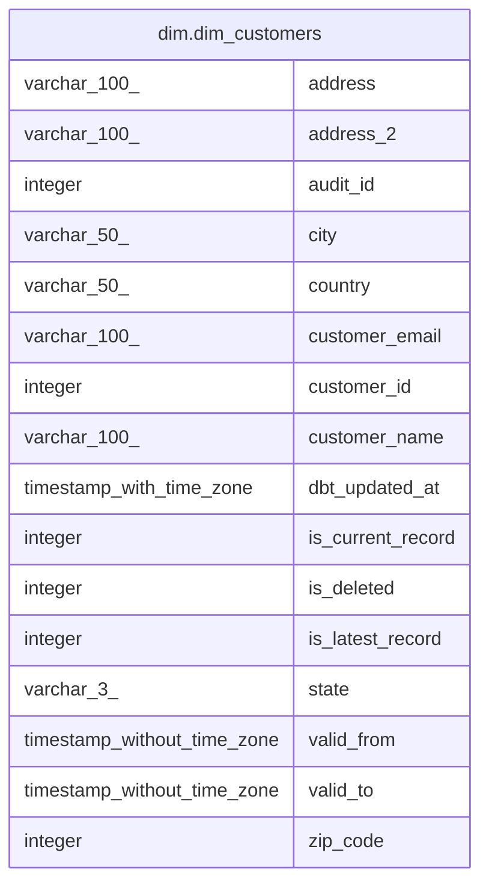

# dim.dim_customers

## Description

## Columns

| #  | Name              | Type                        | Default | Nullable | Children | Parents | Comment |
| -- | ----------------- | --------------------------- | ------- | -------- | -------- | ------- | ------- |
| 1  | address           | varchar(100)                |         | true     |          |         |         |
| 2  | address_2         | varchar(100)                |         | true     |          |         |         |
| 3  | audit_id          | integer                     |         | true     |          |         |         |
| 4  | city              | varchar(50)                 |         | true     |          |         |         |
| 5  | country           | varchar(50)                 |         | true     |          |         |         |
| 6  | customer_email    | varchar(100)                |         | true     |          |         |         |
| 7  | customer_id       | integer                     |         | true     |          |         |         |
| 8  | customer_name     | varchar(100)                |         | true     |          |         |         |
| 9  | dbt_updated_at    | timestamp with time zone    |         | true     |          |         |         |
| 10 | is_current_record | integer                     |         | true     |          |         |         |
| 11 | is_deleted        | integer                     |         | true     |          |         |         |
| 12 | is_latest_record  | integer                     |         | true     |          |         |         |
| 13 | state             | varchar(3)                  |         | true     |          |         |         |
| 14 | valid_from        | timestamp without time zone |         | true     |          |         |         |
| 15 | valid_to          | timestamp without time zone |         | true     |          |         |         |
| 16 | zip_code          | integer                     |         | true     |          |         |         |

## Indexes

| # | Name                             | Definition                                                                                     |
| - | -------------------------------- | ---------------------------------------------------------------------------------------------- |
| 1 | 1c31127c6bbe5caa0339377d16cf7b68 | CREATE INDEX "1c31127c6bbe5caa0339377d16cf7b68" ON dim.dim_customers USING btree (customer_id) |

## Relations

---

> Generated by [tbls](https://github.com/k1LoW/tbls)
