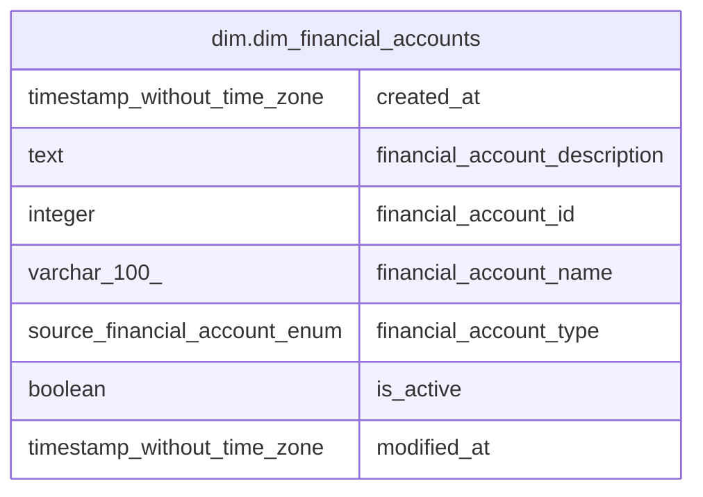

# dim.dim_financial_accounts

## Description

## Columns

| # | Name                          | Type                          | Default | Nullable | Children | Parents | Comment |
| - | ----------------------------- | ----------------------------- | ------- | -------- | -------- | ------- | ------- |
| 1 | created_at                    | timestamp without time zone   |         | true     |          |         |         |
| 2 | financial_account_description | text                          |         | true     |          |         |         |
| 3 | financial_account_id          | integer                       |         | true     |          |         |         |
| 4 | financial_account_name        | varchar(100)                  |         | true     |          |         |         |
| 5 | financial_account_type        | source.financial_account_enum |         | true     |          |         |         |
| 6 | is_active                     | boolean                       |         | true     |          |         |         |
| 7 | modified_at                   | timestamp without time zone   |         | true     |          |         |         |

## Relations

---

> Generated by [tbls](https://github.com/k1LoW/tbls)
