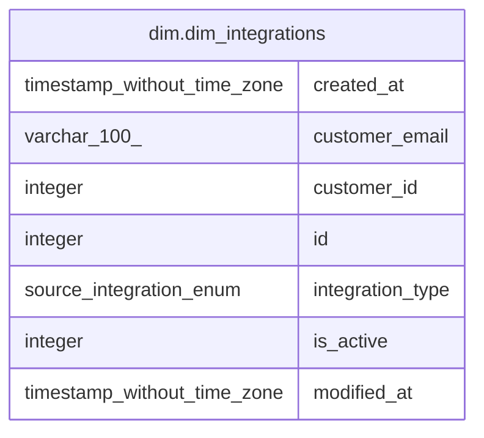

# dim.dim_integrations

## Description

## Columns

| # | Name             | Type                        | Default | Nullable | Children | Parents | Comment |
| - | ---------------- | --------------------------- | ------- | -------- | -------- | ------- | ------- |
| 1 | created_at       | timestamp without time zone |         | true     |          |         |         |
| 2 | customer_email   | varchar(100)                |         | true     |          |         |         |
| 3 | customer_id      | integer                     |         | true     |          |         |         |
| 4 | id               | integer                     |         | true     |          |         |         |
| 5 | integration_type | source.integration_enum     |         | true     |          |         |         |
| 6 | is_active        | integer                     |         | true     |          |         |         |
| 7 | modified_at      | timestamp without time zone |         | true     |          |         |         |

## Relations

---

> Generated by [tbls](https://github.com/k1LoW/tbls)
