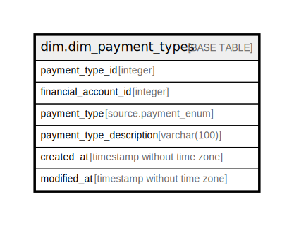

# dim.dim_payment_types

## Description

## Columns

| Name | Type | Default | Nullable | Children | Parents | Comment |
| ---- | ---- | ------- | -------- | -------- | ------- | ------- |
| payment_type_id | integer |  | true |  |  |  |
| financial_account_id | integer |  | true |  |  |  |
| payment_type | source.payment_enum |  | true |  |  |  |
| payment_type_description | varchar(100) |  | true |  |  |  |
| created_at | timestamp without time zone |  | true |  |  |  |
| modified_at | timestamp without time zone |  | true |  |  |  |

## Relations

---

> Generated by [tbls](https://github.com/k1LoW/tbls)
