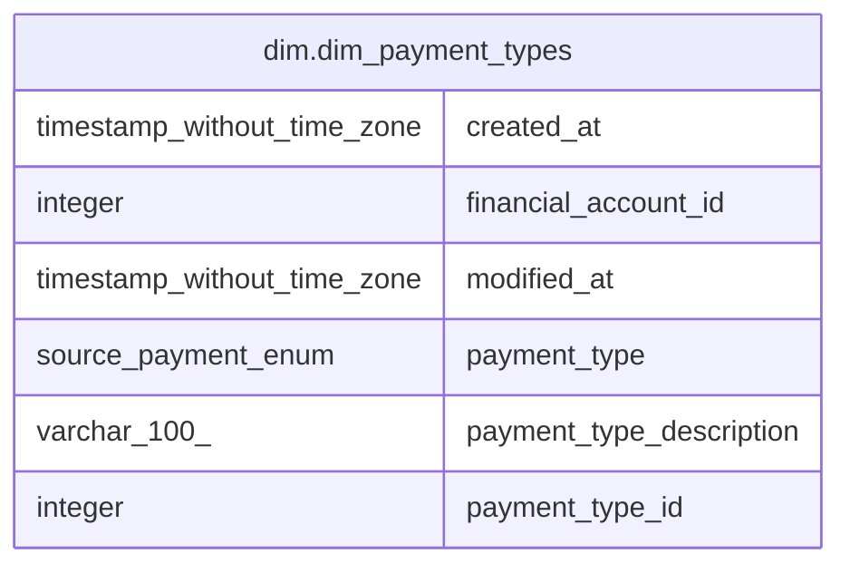

# dim.dim_payment_types

## Description

## Columns

| # | Name                     | Type                        | Default | Nullable | Children | Parents | Comment |
| - | ------------------------ | --------------------------- | ------- | -------- | -------- | ------- | ------- |
| 1 | created_at               | timestamp without time zone |         | true     |          |         |         |
| 2 | financial_account_id     | integer                     |         | true     |          |         |         |
| 3 | modified_at              | timestamp without time zone |         | true     |          |         |         |
| 4 | payment_type             | source.payment_enum         |         | true     |          |         |         |
| 5 | payment_type_description | varchar(100)                |         | true     |          |         |         |
| 6 | payment_type_id          | integer                     |         | true     |          |         |         |

## Relations

---

> Generated by [tbls](https://github.com/k1LoW/tbls)
