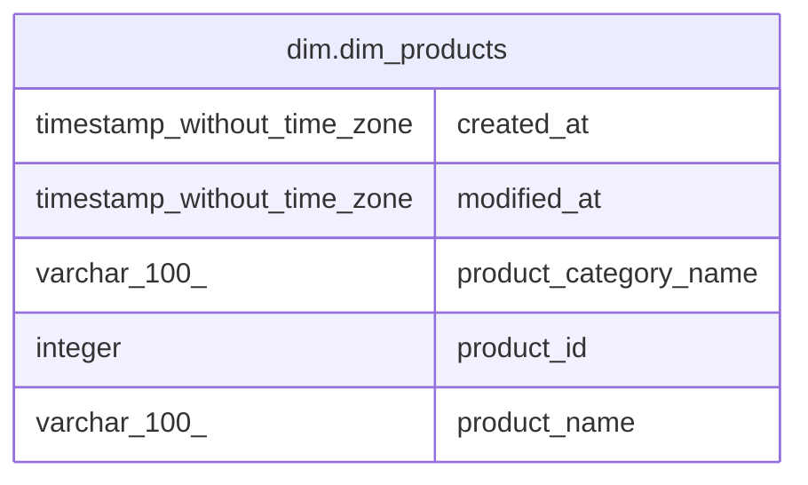

# dim.dim_products

## Description

## Columns

| # | Name                  | Type                        | Default | Nullable | Children | Parents | Comment |
| - | --------------------- | --------------------------- | ------- | -------- | -------- | ------- | ------- |
| 1 | created_at            | timestamp without time zone |         | true     |          |         |         |
| 2 | modified_at           | timestamp without time zone |         | true     |          |         |         |
| 3 | product_category_name | varchar(100)                |         | true     |          |         |         |
| 4 | product_id            | integer                     |         | true     |          |         |         |
| 5 | product_name          | varchar(100)                |         | true     |          |         |         |

## Relations

---

> Generated by [tbls](https://github.com/k1LoW/tbls)
